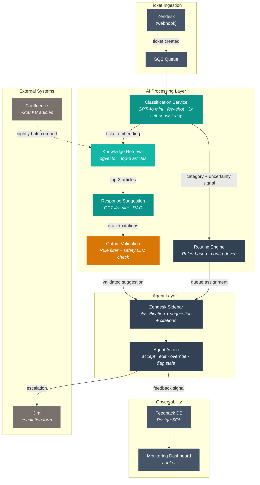

# Design Review 001: AI-Assisted Ticket Triage, Routing, and Agent Response Suggestion for B2B SaaS Support

---

| Dimension    | Value                                          |
| ------------ | ---------------------------------------------- |
| System type  | Product                                        |
| User surface | Internal                                       |
| Latency      | Async                                          |
| Stakes       | Medium                                         |
| Scale        | 1k–100k (800 tickets/day, ~4,000 AI calls/day) |
| Org maturity | On-call exists                                 |

All claims in this design review are scoped to this context.

---

## 1. System Context & Constraints

A mid-market B2B SaaS company — $18M ARR, 2,200 accounts, contracts ranging from $6K/year SMB to $80K+/year enterprise — runs a 12-person support team handling 800 tickets per day in Zendesk. Tickets cover billing, bugs, feature requests, integration failures (webhook delivery, SSO SAML configuration, CSV import column mapping), access issues, and onboarding questions. Everything lands in a single undifferentiated queue. Agents pick up tickets in order and spend the first 5-10 minutes per ticket diagnosing the issue type and whether they can resolve it or need to escalate to engineering via a Jira form.

CSAT has dropped from 78% to 72% over two quarters. Average first-response time is 4.2 hours against a 1-hour enterprise SLA target. Half the volume is variants of the same 30 recurring issues, and agents are writing the same diagnostic steps each time. The VP of Customer Success has seen Zendesk's AI agent demos and is pushing for adoption. The support team lead's position: she wants smarter internal tooling — classification, routing, and response suggestions that agents review before sending — not a customer-facing chatbot. The enterprise accounts are named, they have dedicated CSMs, and a bad automated response during a renewal cycle is a revenue risk she is not willing to take.

The design question: **What reliability envelope does this internal-facing AI system need?** The system must be accurate enough that agents trust its suggestions (target: <30% override rate) but never directly faces the customer — the human review buffer is a non-negotiable architectural constraint.

**Functional requirements**: Classify incoming tickets by issue type and product area. Route tickets to one of 4 queues (billing, technical-product, technical-integration, escalation-engineering). Generate response draft suggestions for the ~50% of tickets matching recurring issues. Integrate with Zendesk (ticket metadata) and Jira (escalation context).

**Non-functional requirements**: Classification latency < 30 seconds from ticket creation. Response suggestion latency < 60 seconds. Availability ≥ 99.5% during business hours. SOC 2 and GDPR compliance for PII in ticket content. No new ML headcount — the system must be operable by backend engineers.

---

## 2. What I Would Not Do

**Refusal 1: I would not deploy a customer-facing AI agent for ticket resolution.**

_Context_: B2B SaaS with enterprise accounts paying $80K+/year, named relationships, dedicated CSMs, and a product complex enough that common issues involve multi-step debugging (SSO SAML flows, webhook retry logic, CSV schema mapping).

_Constraint_: The pressure to "add a chatbot" comes from vendor demos showing consumer-grade resolution rates (40-60% automated resolution). But those benchmarks are built on consumer support patterns — shipping status, password resets, FAQ lookups — where the blast radius of a wrong answer is a mild inconvenience, not a contract renewal at risk.

_Failure mode_: A hallucinated troubleshooting step sent to Meridian Financial ($82K/year, 150 seats, mid-renewal) doesn't just waste their time — it signals that the company can't be trusted with their support experience. The Air Canada precedent (held liable for chatbot misinformation, 2024) established that customers don't distinguish between "the AI was wrong" and "your company gave me wrong information." In a B2B context, one bad automated response to a named enterprise account can cost more than the entire AI system saves in a year.

_Boundary_: This refusal applies to enterprise and mid-market accounts with dedicated relationships and contract values above ~$20K/year. For a high-volume, low-ACV self-serve tier (if one existed), customer-facing resolution for a narrow set of well-defined issues (password reset, billing FAQ) would carry acceptable risk — provided confidence thresholds and human escalation paths are in place.

**Refusal 2: I would not train a custom classification model from scratch.**

_Context_: A team of 2 backend engineers at 20% allocation, no ML expertise, and an 8-week MVP timeline.

_Constraint_: The instinct is to build a custom classifier — collect labeled tickets, fine-tune a model, own the full pipeline. The reasoning sounds prudent: "we'll have more control." But control only matters if you can exercise it. A custom classifier requires labeled training data (at least 500-1000 examples per category), an evaluation pipeline, retraining infrastructure, and someone who understands precision/recall tradeoffs when the model starts drifting.

_Failure mode_: The team spends 6 weeks building a classifier, ships it with 85% accuracy on their test set, and watches accuracy degrade over the next quarter as product changes introduce new issue types that weren't in the training data. Nobody on the team knows how to diagnose the drift or retrain effectively. The model becomes a liability that agents learn to ignore, and the project is quietly shelved.

_Boundary_: Custom classification becomes appropriate when the team has (a) 6+ months of labeled production data, (b) a clear evaluation pipeline, and (c) at least one engineer with ML operations experience. Until then, few-shot classification via a general-purpose LLM (GPT-4o mini, Claude Haiku) is cheaper to build, easier to update (change the prompt, not the model), and good enough for internal-facing triage where the agent is always the final reviewer.

**Refusal 3: I would not build the response suggestion system before the feedback loop.**

_Context_: The natural instinct is to build the visible features first — classification, routing, and response suggestions — and add monitoring later. Feedback loops feel like a "nice to have" for v2.

_Constraint_: Response suggestions are generated from a knowledge base of ~200 Confluence articles that are updated inconsistently. Product ships weekly. The gap between what the knowledge base says and what the product actually does will widen with every release cycle.

_Failure mode_: Without a feedback loop that captures agent overrides (agent saw the suggestion, ignored it or rewrote it), there is no signal to detect when suggestions go stale. The system silently degrades — agents stop trusting it, override rates climb from 15% to 40%, and nobody notices until the next CSAT review. By then the team has lost faith in the system and the political capital to keep iterating.

_Boundary_: If the knowledge base were maintained by a dedicated technical writer with a defined refresh SLA tied to the release cycle, the urgency of the feedback loop would be lower. But in a 12-person support team where knowledge base updates compete with ticket work, agent override tracking is the only reliable signal that content has gone stale.

---

## 3. Metrics & Success Criteria

The success criteria distinguish between classification quality (is the AI categorizing correctly?) and system impact (is agent productivity improving?). Offline metrics validate the model before deployment; online metrics validate the system in production.

**Offline evaluation** (pre-launch, on historical labeled tickets): Classification accuracy ≥ 85% on a held-out set of 500+ labeled tickets across all 4 queues. Response suggestion relevance scored by Dana and 2 senior agents on a 3-point scale (helpful / partially helpful / not helpful) — target ≥ 70% "helpful" on a 100-ticket sample.

**Online evaluation** (post-launch, continuous): The core metrics are agent-observable behaviors — override rate, re-routing rate, and suggestion acceptance rate — not model-internal scores.

| Metric                       | Target                         | Measurement Method                                                  | Frequency             | Failure Signal                            |
| ---------------------------- | ------------------------------ | ------------------------------------------------------------------- | --------------------- | ----------------------------------------- |
| Classification override rate | < 30%                          | Agent reclassifies ticket after AI assignment                       | Daily (rolling 7-day) | Override rate > 35% sustained for 3+ days |
| Routing re-route rate        | < 20%                          | Agent manually moves ticket to a different queue                    | Daily (rolling 7-day) | Re-route rate > 25% sustained for 3+ days |
| Suggestion acceptance rate   | > 50%                          | Agent uses AI draft (with or without edits) vs. writes from scratch | Weekly                | Acceptance rate < 40% for 2+ weeks        |
| First-response time          | < 2 hours (from 4.2h baseline) | Zendesk reporting                                                   | Weekly                | No improvement after 4 weeks              |
| CSAT                         | ≥ 75% (from 72% baseline)      | Post-resolution survey                                              | Monthly               | CSAT flat or declining after 8 weeks      |
| Suggestion staleness rate    | < 10%                          | Agent flags suggestion as outdated via feedback button              | Weekly                | Staleness flags > 15% in any week         |

### Operational Targets

| Target                              | Value        | Rationale                                                                                               |
| ----------------------------------- | ------------ | ------------------------------------------------------------------------------------------------------- |
| Classification latency (P99)        | < 30 seconds | Must complete before agent opens the ticket; business-hours SLA only                                    |
| Suggestion generation latency (P99) | < 60 seconds | Agent reads ticket context first (~30s); suggestion should be ready by the time they need it            |
| Availability (business hours)       | 99.5%        | ~22 hours/year downtime budget; acceptable for internal tooling with graceful fallback to manual triage |

---

## 4. Data Strategy

The knowledge base is the upstream data source that determines the ceiling for response suggestion quality, and it's the weakest link in the chain.

| Data Source                               | Type                                                        | Quality                                                      | Freshness                                           | Lineage                                                 | Privacy Risk                                                    | Drift Risk                                              |
| ----------------------------------------- | ----------------------------------------------------------- | ------------------------------------------------------------ | --------------------------------------------------- | ------------------------------------------------------- | --------------------------------------------------------------- | ------------------------------------------------------- |
| Zendesk ticket history (6 months)         | Semi-structured (subject, body, tags, metadata)             | High — real production data                                  | Real-time (via webhook)                             | Full — ticket ID, timestamps, agent actions all tracked | Medium — contains customer PII (names, emails, account details) | Low — ticket format is stable                           |
| Confluence knowledge base (~200 articles) | Unstructured (markdown, HTML)                               | Medium — inconsistent updates, some articles 6+ months stale | Variable — ranges from current to 6 months outdated | Partial — no version tracking tied to product releases  | Low — internal documentation                                    | High — product ships weekly; articles drift out of sync |
| Jira escalation history                   | Structured (ticket type, component, resolution)             | High — engineering-maintained                                | Real-time                                           | Full — linked to Zendesk tickets via integration        | Low — internal data                                             | Low — schema is stable                                  |
| Agent action logs (new)                   | Structured (override, reclassify, accept, edit, flag-stale) | N/A — to be instrumented                                     | Real-time (post-deployment)                         | Full — tied to ticket ID + agent ID                     | Low — internal operational data                                 | N/A — new data stream                                   |

**Key data risk**: Confluence articles are the retrieval corpus for response suggestions. With ~200 articles and no staleness tracking, roughly 15-25% may be outdated at any given time (estimated from weekly release cadence and sporadic update pattern). A response suggestion generated from a stale article is confidently wrong — it reads like a real answer but references a feature flow that changed two releases ago. This is the primary silent failure vector.

**Mitigation**: Tie Confluence article metadata to the product release calendar. Flag any article not updated within 2 release cycles (~2 weeks) for review. Use agent "flag stale" actions as a secondary staleness signal.

---

## 5. Architecture & Data Flow

This system has defined interfaces (Zendesk webhook → classification API → routing rules → suggestion API → agent UI), budgets (token limits per suggestion, latency SLOs), failure modes (enumerated in §6), and observability (override rate tracking, staleness monitoring). It is a component, not a bolt-on.

### Components

**1. Ticket Ingestion Layer** — Zendesk webhook fires on ticket creation. Extracts subject, body, customer metadata (account tier, product plan), and channel. Publishes to an SQS queue for async processing. Zendesk webhooks can fire multiple times for the same event (retries on timeout, ticket update triggers), so the SQS consumer deduplicates using a composite key (ticket_id + event_type + timestamp window). If a classification already exists for a ticket and the ticket content hasn't changed, the duplicate event is discarded. Ticket attachments (logs, screenshots) are not ingested in v1 — attachment content is not parsed or embedded. Attachment presence is noted in ticket metadata (`has_attachments: true/false`) and passed to the classification prompt as a signal.

**2. Classification Service** — Consumes from SQS. Calls GPT-4o mini with a few-shot prompt containing the 4-queue taxonomy and 5-8 exemplar tickets per queue. The prompt constrains output to one of the 4 queue labels (no freeform classification). Returns: issue_category, product_area, severity_estimate. Uncertainty is derived from a self-consistency check: the classification runs 3 times per ticket, and agreement across runs produces the uncertainty signal. 3/3 agreement = high confidence, 2/3 majority = medium confidence, no majority = low confidence (ticket flagged as uncertain). This is mechanistically grounded — it measures whether the model's classification is stable across samples, not whether the model self-reports certainty. At GPT-4o mini pricing, the 3x cost is negligible ($0.21/day vs. $0.07/day). Writes classification + uncertainty signal to Zendesk ticket tags via API.

**3. Routing Engine** — Deterministic rules engine (not ML). Maps classification output to queue assignment using a routing table maintained by Dana. Rules include: enterprise accounts (>$50K ARR) → priority queue; severity=critical → escalation-engineering; issue_category=billing → billing queue. The routing table is a config file, not code — Dana can update it without a deploy.

**4. Knowledge Retrieval** — Embeds ticket content using text-embedding-3-small. Retrieves top-3 matching Confluence articles from a pgvector index (on existing RDS PostgreSQL). Returns article content + metadata (last_updated, linked_product_version).

**5. Response Suggestion Generator** — Calls GPT-4o mini with: system prompt (tone, format, company context) + retrieved articles + ticket content. Generates a draft response. Includes article citations so the agent can verify the source. Only triggers for tickets matching recurring issue categories (configurable allowlist). Before the suggestion reaches the agent UI, it passes through an **output validation gate**: a lightweight rule-based filter plus a second LLM call with a focused safety prompt. The filter rejects suggestions that request credentials from the customer, contain external links not present in the source knowledge base articles, make policy or pricing claims, or instruct the customer to disable security features. This adds ~1-2 seconds of latency (well within the 60-second suggestion budget) and catches manipulated suggestions that might look plausible to a busy agent.

**6. Agent Feedback Collector** — Instruments the Zendesk agent UI (via Zendesk app or sidebar extension) to capture: accepted / edited / overridden / flagged-stale for each suggestion. Writes to a feedback table in PostgreSQL.

**7. Monitoring Dashboard** — Looker dashboard (extending existing reporting) showing: override rate, re-route rate, acceptance rate, staleness flags, self-consistency agreement distribution, per-queue volume.

### Architecture Diagram

The critical architectural insight: the **agent is always in the loop**. Classification, routing, and suggestions are advisory. The agent reviews before anything reaches the customer. This human review buffer is the system's primary safety layer — and the reason the stakes are medium rather than high.

### Complexity Justification

Every component earns its place by reducing a named risk — if it doesn't, it shouldn't exist.

The **RAG pipeline** (knowledge retrieval + response suggestion) is the most complex subsystem. It introduces embedding drift, retrieval quality variance, and generation hallucination risk. The justification: without grounded retrieval, the LLM generates responses from parametric knowledge alone, which knows nothing about NovaCRM's specific product behavior. A simpler alternative — keyword search against Confluence — fails on intent-based queries ("customer can't sync contacts to Salesforce" doesn't keyword-match "webhook configuration guide"). The RAG pipeline exists because the alternative produces worse suggestions for the exact ticket types that matter most.

The **routing engine** is deliberately rule-based, not ML. Queue assignment needs configurability and transparency — Dana needs to update routing rules when team structure changes, and agents need to understand why a ticket landed in their queue. A rules engine is the simpler approach, and it works here. Introducing ML for routing would add complexity without reducing a failure mode that the rules engine doesn't already handle.

The **few-shot classification** approach (vs. fine-tuned model) is justified by the team's constraints, not technical superiority. A fine-tuned classifier might achieve higher accuracy, but the team can't build, evaluate, or maintain one. The complexity of a custom model exceeds the team's operational capacity. Few-shot prompts can be updated by a backend engineer in minutes; retraining a model requires ML expertise the team doesn't have.

### Scale Mechanisms

| Mechanism                     | What It Addresses                                                           | When It Kicks In                                                |
| ----------------------------- | --------------------------------------------------------------------------- | --------------------------------------------------------------- |
| SQS queue buffering           | Decouple ingestion from classification; handle burst traffic                | Built-in from day 1                                             |
| pgvector on existing RDS      | Knowledge retrieval without a new service; scales to ~100K vectors          | Current (200 articles ≈ 200 vectors, headroom to 100K)          |
| Classification result caching | Avoid re-classifying tickets on metadata updates (ticket edited, tag added) | >1K tickets/day                                                 |
| Batch embedding refresh       | Re-embed Confluence articles nightly instead of on every edit               | Current (200 articles; nightly batch is simpler than real-time) |

### Integration Rate Limits

Zendesk API write-backs (updating ticket tags and custom fields with classification results) are rate-limited at ~700 requests/minute. At 800 tickets/day (~1 ticket/minute average during business hours), this is well within limits. Jira ticket creation API (for engineering escalations) has lower limits (~100 requests/minute), but escalation volume is a small fraction of total tickets. Both integrations use retry with exponential backoff and jitter. At 10x scale (8,000 tickets/day), Zendesk write-backs remain within limits (~6 requests/minute average), but burst patterns during morning queue processing may require request batching or rate-aware queuing.

---

## 6. Failure Modes & Detection

The most dangerous failures in this system are silent — the AI returns a plausible but wrong classification or suggestion, the agent doesn't catch it (or catches it but doesn't report it), and the error compounds across hundreds of tickets.

| Failure Mode                                                                                                                                                                                                                                                   | Severity | Detection Signal                                                                                                                       | Detection Latency                                                                                                              | Blast Radius                                                           | Silent? |
| -------------------------------------------------------------------------------------------------------------------------------------------------------------------------------------------------------------------------------------------------------------- | -------- | -------------------------------------------------------------------------------------------------------------------------------------- | ------------------------------------------------------------------------------------------------------------------------------ | ---------------------------------------------------------------------- | ------- |
| **Stale response suggestion** — AI suggests troubleshooting steps referencing an outdated feature flow                                                                                                                                                         | High     | Agent "flag stale" action; staleness rate metric > 10%                                                                                 | Hours to days (depends on agent reporting)                                                                                     | Per-ticket — but erodes agent trust in the system                      | Yes     |
| **Systematic misclassification** — A product change introduces a new issue type not in the classification taxonomy, or the few-shot examples in the classification prompt become stale as product categories shift; tickets consistently routed to wrong queue | High     | Re-route rate spike > 25% sustained for 3+ days; monthly accuracy audit (sample 50 tickets against human labels) detects gradual drift | 1-3 days for acute shifts (requires pattern accumulation); up to 4 weeks for gradual prompt staleness without scheduled audits | Cross-queue — agents in wrong queue waste time, right queue is starved | Yes     |
| **Uncertainty signal miscalibration** — Self-consistency check agrees (3/3) on the wrong answer for ambiguous tickets, producing a false high-confidence signal that suppresses agent skepticism                                                                | Medium   | Compare self-consistency agreement rate against override rate; high-agreement overrides are the key signal                             | Weeks (requires statistical accumulation)                                                                                      | Subtle — agents over-trust the system on edge cases                    | Yes     |
| **Knowledge retrieval miss** — pgvector returns irrelevant articles due to embedding mismatch; suggestion is generated from wrong context                                                                                                                      | Medium   | Low suggestion acceptance rate for specific issue categories                                                                           | Days to weeks                                                                                                                  | Per-category — some issue types get consistently bad suggestions       | Yes     |
| **Zendesk webhook failure** — Tickets are created but webhook doesn't fire; no classification or routing occurs                                                                                                                                                | Low      | Missing classification tag on ticket; SQS queue depth = 0 during business hours                                                        | Minutes                                                                                                                        | All tickets during outage revert to manual triage                      | No      |
| **LLM API outage** — OpenAI API is down or rate-limited                                                                                                                                                                                                        | Low      | HTTP 429/5xx from classification service; circuit breaker trips                                                                        | Seconds                                                                                                                        | All tickets during outage revert to manual triage                      | No      |

The first four failure modes are all silent — the system doesn't crash, it just becomes wrong. The stale suggestion problem is the most dangerous because it's the hardest to detect without instrumented agent feedback. A stale article looks like a real article. A suggestion generated from a stale article looks like a real suggestion. Only the agent — who knows the current product behavior — can catch it.

---

## 7. Mitigations & Deployment

| Failure Mode                 | Mitigation                                                                                                                                             | Degraded State                                                                                    | HITL Boundary                                                            | Rollback Plan                                                           |
| ---------------------------- | ------------------------------------------------------------------------------------------------------------------------------------------------------ | ------------------------------------------------------------------------------------------------- | ------------------------------------------------------------------------ | ----------------------------------------------------------------------- |
| Stale response suggestion    | Confluence article freshness flag (>2 release cycles = stale); suppress suggestions from stale articles; agent "flag stale" button                     | Suggestion withheld for stale-flagged categories; agent writes response manually                  | Agent is always the reviewer — this is the system's primary safety layer | Disable suggestion generation per-category or globally via feature flag |
| Systematic misclassification | Weekly classification audit (sample 50 tickets, verify labels); re-route rate alerting; taxonomy update process tied to product release calendar. Engineering release checklist includes: "Does this release introduce, remove, or modify a support issue category?" If yes, classification prompt and few-shot examples are updated before the release reaches customers | Routing falls back to round-robin assignment (pre-AI behavior)                                    | Dana reviews re-route rate weekly; >25% triggers taxonomy review         | Disable routing and revert to shared queue via Zendesk config           |
| Uncertainty signal miscalibration | Display self-consistency agreement to agent (3/3, 2/3, or no majority); no-majority tickets get a visual "uncertain" flag; log agreement level vs. override rate for calibration monitoring. Calibration threshold tuned empirically during Phase 1 shadow mode using historical override data | No-majority tickets show classification as "suggested" not "assigned"; agent manually confirms | Agent sees agreement signal and decides how much to trust                | Tighten the uncertainty threshold (e.g., flag 2/3 agreement as uncertain too) |
| Knowledge retrieval miss     | A/B track acceptance rate by issue category; categories with <30% acceptance rate flagged for knowledge gap review                                     | Disable suggestions for flagged categories; agent relies on Confluence directly                   | Agent always reviews before sending; can ignore suggestion entirely      | Disable suggestion for specific categories via config                   |
| Zendesk webhook failure      | Dead-letter queue for failed webhooks; retry with exponential backoff; alert on SQS depth = 0 during business hours                                    | Manual triage — agents pick from shared queue as they do today                                    | N/A — failure is visible (no classification tag on ticket)               | N/A — system already degrades to pre-AI behavior                        |
| LLM API outage               | Circuit breaker (3 failures in 60s → open); fall back to keyword-based classification using existing Zendesk triggers                                  | Keyword classification + manual routing — the pre-AI workflow                                     | N/A — automatic fallback                                                 | N/A — circuit breaker auto-recovers when API returns                    |

### Deployment Strategy

**Phase 1 — Shadow mode (weeks 1-2)**: Classification runs on all tickets but results are logged, not applied. Compare AI classification against agent-applied tags on a sample of 200 tickets. Validate accuracy ≥ 85% before proceeding.

**Phase 2 — Classification + routing only (weeks 3-6)**: AI classification is applied to tickets. Routing suggestions shown to agents as "suggested queue" — agents can accept or override. Response suggestions not yet enabled. Collect override and re-route data.

**Phase 3 — Response suggestions (weeks 7-12)**: Enable response suggestions for the top 10 recurring issue categories only (highest confidence, best knowledge base coverage). Expand to remaining categories based on acceptance rate data.

**Phase 4 — Full production (weeks 13-16)**: All categories enabled. Feedback loop operational. Staleness monitoring active. Weekly review cadence established.

**Kill switch**: Feature flag per component (classification, routing, suggestions). Each can be disabled independently without affecting the others. Full rollback returns agents to the shared queue with keyword triggers — the exact workflow they use today.

### Production Readiness Assessment

| #  | Check                        | Status | Evidence                                                                                               |
| -- | ---------------------------- | ------ | ------------------------------------------------------------------------------------------------------ |
| 1  | Failure modes enumerated     | Pass   | 6 failure modes in §6 with severity, detection signal, detection latency, blast radius                 |
| 2  | Detection signals defined    | Pass   | Each failure mode has a named detection signal and estimated detection latency (§6)                    |
| 3  | Fallback exists              | Pass   | Every component degrades to pre-AI workflow via feature flags; pre-AI queue is the universal fallback  |
| 4  | Scale envelope known         | Pass   | Cost and architecture projections at current, 10x, and 100x (§8); nonlinear cliffs identified         |
| 5  | Rollback plan exists         | Pass   | Per-component feature flags; full rollback = shared queue with keyword triggers                        |
| 6  | Ownership assigned           | Pass   | Dana owns routing config and KB maintenance; backend engineer owns classification service and monitoring |
| 7  | Data dependencies documented | Pass   | 4 data sources with quality, freshness, lineage, privacy risk, drift risk (§4)                        |
| 8  | Human override available     | Pass   | Agent reviews every classification and suggestion before any action reaches the customer               |
| 9  | Audit trail exists           | Pass   | Feedback DB logs every agent action (accept/edit/override/flag-stale) tied to ticket ID + agent ID    |
| 10 | Kill criteria defined        | Pass   | Override rate > 35% for 3+ days, acceptance < 40% for 2+ weeks, staleness > 15% in any week (§3)     |

**Score: 10/10** — with caveats. The score reflects the design, not a deployed system. Items 6 (ownership) and 9 (audit trail) depend on implementation following the design. The most fragile item is #7 (data dependencies): the Confluence knowledge base's quality is documented but not yet controlled. A score of 10 on paper becomes 7-8 if knowledge base maintenance isn't actually resourced.

### Trust Engineering

Trust in this system is engineered through four measurable dimensions, not assumed through deployment.

| Dimension                | Implementation                                                                                                                | Measurement                                                                                     |
| ------------------------ | ----------------------------------------------------------------------------------------------------------------------------- | ----------------------------------------------------------------------------------------------- |
| **Error visibility**     | Self-consistency agreement level displayed to agents; suggestions include article citations so agents can verify the source material | Time-to-detection via override rate monitoring; staleness flag frequency                        |
| **Calibrated uncertainty** | Self-consistency check (3x classification, measure agreement) produces the uncertainty signal; no-majority tickets show classification as "suggested" not "assigned" with a visual "uncertain" flag. Calibration validated during Phase 1 shadow mode by comparing agreement levels against agent override patterns | Abstention rate (% of tickets flagged uncertain); agreement-vs-override correlation            |
| **Reversibility**        | Every agent action (accept/edit/override/flag-stale) is logged in the feedback DB; no AI output reaches the customer directly | Feedback DB coverage (target: 100% of AI-assisted tickets logged); rollback success via feature flags |
| **Human override**       | Agents can reclassify, re-route, rewrite, or ignore any AI output; "flag stale" button for knowledge base issues             | Override availability is 100% by design; override latency is zero (inline in agent workflow)    |

Calibrated uncertainty is the most important dimension here. A system that is confident when wrong erodes trust faster than a system that says "I'm not sure." The self-consistency mechanism and visual "uncertain" flag are the primary trust engineering mechanisms — they give agents permission to apply their own judgment on ambiguous tickets rather than deferring to the AI. Unlike a raw LLM confidence score (which is poorly calibrated and often overconfident), self-consistency measures whether the model produces the same answer when asked multiple times — a mechanistic signal that is cheaper to validate and more interpretable to agents.

### Build vs. Run Discipline

Building this system and running it are different disciplines with different costs, artifacts, and failure modes.

| Dimension          | Build Phase (Weeks 1-16)                                                      | Run Phase (Ongoing)                                                                                       |
| ------------------ | ----------------------------------------------------------------------------- | --------------------------------------------------------------------------------------------------------- |
| **Primary skill**  | API integration, prompt engineering, UI development                           | Monitoring, prompt maintenance, knowledge base lifecycle                                                  |
| **Key artifacts**  | Architecture design, classification prompt, suggestion prompt, Zendesk app, feedback schema | Runbook for override rate spikes, staleness response playbook, taxonomy update process tied to releases    |
| **Failure mode**   | Wrong architecture (e.g., no feedback loop), wrong prompt design              | Missing degradation signal, stale prompts, knowledge base drift undetected                                |
| **Cost**           | $18,000 (2 engineers × 20% × 16 weeks)                                       | $21,600/year (Dana's KB maintenance + engineer monitoring)                                                |
| **Success metric** | Classification accuracy ≥ 85%, suggestion relevance ≥ 70%                    | Override rate < 30%, staleness rate < 10%, first-response time < 2 hours                                  |

The run cost exceeds the build cost by year 2 ($21,600/year ongoing vs. $18,000 one-time). Under-budgeting for the run phase — assuming the system is "done" after launch — is the most likely cause of project failure. The $12,000/year for Dana's knowledge base maintenance is the single largest ongoing cost, and it's the one most likely to be cut when budgets tighten. If it is cut, suggestion quality degrades within weeks.

---

## 8. Cost Model

| Component                                 | Unit Cost                       | Volume/Day                                   | Daily Cost | Monthly Cost                      |
| ----------------------------------------- | ------------------------------- | -------------------------------------------- | ---------- | --------------------------------- |
| Classification (GPT-4o mini, 3x self-consistency) | $0.15/1M input, $0.60/1M output | 2,400 calls × ~350 input + 50 output tokens   | $0.21      | $6.30                             |
| Ticket embedding (text-embedding-3-small) | $0.02/1M tokens                 | 800 calls × ~500 tokens                      | $0.008     | $0.24                             |
| Response suggestion (GPT-4o mini)         | $0.15/1M input, $0.60/1M output | 400 calls × ~1,750 input + 400 output tokens | $0.20      | $6.00                             |
| KB embedding refresh (nightly batch)      | $0.02/1M tokens                 | 200 articles × ~800 tokens                   | ~$0.003    | $0.10                             |
| pgvector (on existing RDS)                | $0 incremental                  | —                                            | —          | $0 (within existing RDS capacity) |
| SQS                                       | $0.40/1M requests               | ~2,400 messages/day                          | $0.001     | $0.03                             |
| **Total API + infrastructure**            |                                 |                                              | **$0.42**  | **~$12.70**                       |

The LLM API cost is negligible — under $13/month at current volume (including the 3x self-consistency calls for classification). The real costs are human and organizational:

| Cost Category                                    | First Year   | Ongoing/Year | Notes                                              |
| ------------------------------------------------ | ------------ | ------------ | -------------------------------------------------- |
| Engineering build (2 engineers × 20% × 16 weeks) | $18,000      | —            | Opportunity cost at ~$150K/year loaded             |
| Zendesk app development / integration            | $5,000       | $2,000       | Custom sidebar app for suggestions + feedback      |
| LLM API costs                                    | $150         | $150         | GPT-4o mini (incl. 3x self-consistency) + embeddings at current volume |
| Knowledge base maintenance (Dana, ~5 hrs/week)   | $12,000      | $12,000      | Support team lead at ~$90K/year; 5 hrs/week = ~13% |
| Monitoring + iteration (engineer, ~2 hrs/week)   | $7,500       | $7,500       | Backend engineer at ~$150K/year; 2 hrs/week = ~5%  |
| **Total**                                        | **~$42,600** | **~$21,600** | Within $40-80K first-year budget                   |

### Scale Projection

| Scale Tier            | Volume/Day     | Monthly API Cost | What Changes Architecturally                                                                                                                                                                        |
| --------------------- | -------------- | ---------------- | --------------------------------------------------------------------------------------------------------------------------------------------------------------------------------------------------- |
| Current               | 800 tickets    | ~$12.70          | Baseline (includes 3x self-consistency for classification)                                                                                                                                          |
| 10x (8,000 tickets)   | 8,000 tickets  | ~$127            | Need classification result caching; SQS throughput fine; pgvector fine at 200 articles; may need to batch suggestion generation                                                                     |
| 100x (80,000 tickets) | 80,000 tickets | ~$1,270          | Need dedicated vector DB (Pinecone or separate pgvector instance); async suggestion pipeline; classification model fine-tuning to reduce per-call cost (and self-consistency cost); likely need multiple LLM provider fallbacks |

**What breaks first at 10x?** Not the AI — it's the knowledge base maintenance. At 8,000 tickets/day, the 200-article knowledge base covers a smaller fraction of issue diversity. Dana's 5 hours/week of maintenance becomes insufficient. The organizational process for keeping content current becomes the bottleneck before any technical component does.

**What's the cost cliff?** There isn't one at the API level — GPT-4o mini pricing is linear and cheap. The cliff is human: when ticket volume outgrows the knowledge base coverage, suggestion quality drops, override rates climb, and the system loses agent trust. That failure mode looks like a cost problem (the system isn't worth its maintenance investment) but it's actually a data quality problem.

### Scale Architecture Test

Four questions at the current scale tier (1k–100k):

**1. What's the bottleneck?** At current scale (800 tickets/day, ~4,000 API calls/day including 3x self-consistency), there is no bottleneck — the system runs well within the capacity of every component. At 10x (8,000 tickets/day), the bottleneck shifts to organizational capacity: the 200-article knowledge base covers a shrinking fraction of issue diversity, and Dana's 5 hours/week of KB maintenance becomes insufficient. The LLM API throughput is not a concern — GPT-4o mini rate limits accommodate 40,000 calls/day without issue.

**2. Where's the nonlinear cliff?** The pgvector index on existing RDS PostgreSQL scales smoothly to ~100K vectors (currently 200). The technical cliff is at 100x: 80,000 tickets/day generating embeddings and queries would require a dedicated vector database or separate pgvector instance. SQS has no practical cliff at these volumes. The organizational cliff arrives earlier: at approximately 3,000-4,000 tickets/day, the 200-article knowledge base likely covers fewer than 40% of unique issue types, and suggestion quality degrades nonlinearly as the retrieval corpus falls further behind the product surface area.

**3. What's the latency budget?** Per-component allocation to meet the 30-second classification SLO and 60-second suggestion SLO:

| Component                          | Budget  | Estimated Actual |
| ---------------------------------- | ------- | ---------------- |
| Zendesk webhook → SQS              | < 2s    | ~500ms           |
| SQS → Classification Service       | < 3s    | ~1s              |
| Classification (GPT-4o mini, 3x parallel) | < 20s   | ~3-7s     |
| Ticket embedding                   | < 5s    | ~1-2s            |
| pgvector retrieval                 | < 2s    | ~100ms           |
| Response suggestion (GPT-4o mini)  | < 30s   | ~5-15s           |
| **Total classification path**      | **< 30s** | **~6-12s**     |
| **Total suggestion path**          | **< 60s** | **~12-27s**    |

Headroom is sufficient at current scale. At 10x, classification latency remains stable (independent calls). Suggestion latency may increase if API rate limiting introduces queuing delays, addressable by batching or adding a secondary LLM provider.

**4. What's the availability design?** Target: 99.5% during business hours (~22 hours/year downtime budget). The availability design is failover-by-degradation: every AI component has a feature flag, and disabling any component returns agents to the pre-AI workflow. There is no redundancy in the AI layer at launch — no multi-provider LLM fallback. The single point of failure is the OpenAI API. At 10x, adding a secondary LLM provider (Claude Haiku, Gemini Flash) with automatic failover would improve availability toward 99.9%.

### Cost Validation

| Cost Line Item         | Claimed Unit Cost | Published Price Source                                           | Match? |
| ---------------------- | ----------------- | ---------------------------------------------------------------- | ------ |
| GPT-4o mini input      | $0.15/1M tokens   | OpenAI pricing page (platform.openai.com/docs/pricing), Feb 2026 | Yes    |
| GPT-4o mini output     | $0.60/1M tokens   | OpenAI pricing page, Feb 2026                                    | Yes    |
| text-embedding-3-small | $0.02/1M tokens   | OpenAI pricing page, Feb 2026                                    | Yes    |
| SQS                    | $0.40/1M requests | AWS SQS pricing page                                             | Yes    |

**Arithmetic check**: Classification (3x self-consistency): 2,400 × 350 = 840K input tokens × $0.15/1M = $0.126; 2,400 × 50 = 120K output × $0.60/1M = $0.072; subtotal = $0.198/day ≈ $0.21/day. Suggestion: 400 × 1,750 = 700K input × $0.15/1M = $0.105; 400 × 400 = 160K output × $0.60/1M = $0.096; subtotal = $0.201/day. Total API: ~$0.42/day × 30 = ~$12.70/month. Confirmed.

---

## 9. Security & Compliance

**PII flow**: Customer tickets contain names, email addresses, account identifiers, and potentially sensitive business data (integration credentials in error messages, internal URLs). This data flows from Zendesk → SQS → Classification Service → LLM API → back to Zendesk. The LLM API call is the critical boundary.

**Data minimization**: Not all ticket fields need to reach the LLM. The classification and suggestion services apply field-level filtering before each API call:

| Field | Sent to LLM? | Treatment |
|-------|--------------|-----------|
| Ticket subject | Yes | Sent as-is (low PII density) |
| Ticket body | Yes, redacted | Regex-based redaction of email addresses, phone numbers, API keys, and URLs containing tokens or secrets before LLM call |
| Customer name | No | Replaced with account tier label (e.g., "Enterprise account") for context without identity |
| Customer email | No | Stripped before LLM call |
| Account ID | Yes | Internal identifier, low sensitivity |
| Attachments | No | Not ingested in v1; attachment presence noted as metadata only (`has_attachments: true/false`) |

The redaction layer is regex-based and runs before serialization to the LLM prompt. It is not a guarantee against all PII leakage (names embedded in ticket body prose will not be caught), but it removes the highest-density PII fields and structured patterns. A more sophisticated NER-based redaction pipeline would be appropriate if the system ever processes tickets from regulated industries (healthcare, financial services).

**SOC 2 compliance**: NovaCRM's SOC 2 Type II certification requires that customer data is processed within approved vendor boundaries. OpenAI's API is covered under their enterprise DPA and SOC 2 report. The integration must use the API tier (not the consumer product) and ensure data is not used for model training (opt-out via API terms). If a non-SOC 2-certified provider is considered, it would require a vendor security review and DPA amendment.

**GDPR (EU customers)**: Ticket content from EU customers is personal data under GDPR. The LLM API call constitutes data processing. Required: DPA with the LLM provider covering EU data, data residency documentation, and right-to-erasure capability (if a customer requests deletion, their ticket data must be removable from all systems, including any embeddings stored in pgvector). Embedding vectors derived from ticket content are considered derived personal data — a deletion request requires re-embedding the corpus without the deleted content.

**Retention & deletion**: LLM prompts and responses are retained in application logs for 30 days for debugging and quality monitoring, then purged automatically. Ticket embeddings in pgvector are deleted on erasure request by ticket ID lookup; the affected vectors are removed and the index is rebuilt. Agent feedback records (override/accept logs) are retained indefinitely as operational data — these records contain only ticket ID and action type, no customer PII, so they fall outside erasure scope. Classification results stored as Zendesk ticket tags follow Zendesk's native retention and deletion lifecycle.

**Adversarial risk**: The system is internal-facing, but prompt injection via ticket content is a real attack surface, not a theoretical one — customers control the ticket body, and a crafted payload is trivial to construct. Three layers of defense address this:

1. **Structured input delimiting**: Classification and suggestion prompts use explicit delimiters and role separation to isolate customer-supplied content from system instructions. The classification output is constrained to one of 4 queue labels (no freeform generation), which limits the blast radius of injection on the classification path.
2. **Output validation gate** (§5, Component 5): Response suggestions pass through a content policy filter before reaching the agent UI. The filter rejects suggestions containing credential requests, unauthorized external links, policy/pricing claims, or instructions to disable security features. This catches manipulated suggestions that might look plausible — a prompt injection that produces a "helpful" response asking the customer to share their API key, for example.
3. **Agent review buffer**: Agents review every suggestion before it reaches the customer. This remains the final safety layer, but it is not sufficient alone — a busy agent reviewing 80+ tickets/day may not catch a subtly manipulated suggestion that reads like a normal response. The output validation gate exists precisely because the agent buffer has throughput limits on attention.

**Access control**: Agent feedback data (override patterns, acceptance rates) should be aggregated for monitoring, not attributed to individual agents for performance evaluation. Using override data punitively would discourage agents from providing the feedback signal the system needs to improve.

---

## 10. What Would Change My Mind

**Reversal 1: If Zendesk Intelligent Triage meets classification targets in a shadow evaluation, I would not build a custom classification service.** The test: run Zendesk's built-in intelligent triage in shadow mode on 2 weeks of live ticket volume, mapping its output to our 4-queue taxonomy. If it achieves ≥85% accuracy — including on the product-specific integration categories (webhook failures, SSO SAML, CSV mapping) that are the hardest to classify generically — and the configuration effort is under 2 engineering days, the custom classification service adds complexity without benefit. I would still build the response suggestion system and feedback loop, but classification and routing would be Zendesk-native. The bar is not "zero configuration" (which is unrealistic for product-specific categories) but "configuration effort that a backend engineer can complete in a sprint without ML expertise."

**Reversal 2: If the team hires a dedicated technical writer who maintains the knowledge base with a defined SLA tied to the release cycle, the urgency of the automated staleness detection system drops significantly.** A human-maintained knowledge base with a guaranteed 1-week freshness SLA would reduce the risk of stale suggestions to acceptable levels. The feedback loop would still matter, but the staleness detection infrastructure could be simpler (periodic audits rather than real-time flagging).

**Reversal 3: If LLM inference costs drop by another 10x and hallucination rates drop below 2% on grounded retrieval tasks, the calculus for customer-facing AI resolution changes.** The refusal to deploy customer-facing AI (§2, Refusal 1) is based on current hallucination risk and the asymmetric cost of a wrong answer to an enterprise account. If the technology matures to a point where grounded answers are reliable enough to trust without human review — and that reliability can be measured and monitored — the internal-only constraint would be worth revisiting for a narrow set of well-defined, low-risk query types.

---

