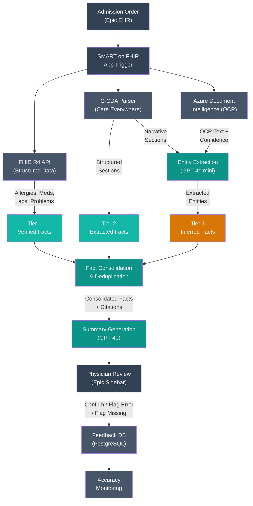

# Design Review 002: AI-Assisted Clinical Document Summarization for Hospital Admissions

---

| Dimension    | Value                                                            |
| ------------ | ---------------------------------------------------------------- |
| System type  | Product                                                          |
| User surface | Internal                                                         |
| Latency      | Sync                                                             |
| Stakes       | High                                                             |
| Scale        | 1k–100k (65 admissions/day, ~2,000/month, 15-20 concurrent peak)|
| Org maturity | On-call exists                                                   |

All claims in this design review are scoped to this context.

---

## 1. System Context & Constraints

Lakeview Regional Medical Center is a 400-bed teaching hospital in the U.S. Midwest, affiliated with a state university medical school. The hospital runs Epic as its primary Electronic Health Record (EHR) system — the same platform used by 42% of U.S. acute care hospitals and covering 55% of all hospital beds. Epic's Care Everywhere module connects Lakeview to a regional Health Information Exchange (HIE) network that includes two nearby critical access hospitals and three large health systems.

Dr. Sarah Chen is a hospitalist — an internal medicine physician who manages inpatients from admission to discharge. She begins each shift with a census of 18 patients. For each new admission, she opens the patient's chart in Epic and faces a record that may span 130 to 500+ pages: structured labs and vitals, medication administration records, imaging reports, prior discharge summaries, consult notes — plus scanned PDFs that arrived through Care Everywhere from outside facilities. Some external records are legible typed reports; others are handwritten notes or low-resolution faxes from rural clinics. She has roughly 15 minutes to form an assessment before rounding begins.

Last month, Dr. Chen almost ordered trimethoprim-sulfamethoxazole (a sulfa-based antibiotic) for a patient whose documented sulfa allergy was buried in a scanned outside emergency department visit summary — page 47 of a faxed record set. A pharmacy cross-check caught it. But pharmacy only catches drug-allergy interactions flagged in the structured allergy list. If the allergy never makes it from the scanned PDF into the structured record, the safety net has a hole.

The hospital's Chief Medical Information Officer (CMIO) has been evaluating AI-assisted chart summarization tools. Epic's native "Insights" feature — used over 16 million times per month across Epic's customer base — provides encounter-level summaries, but it works only on structured Epic data. It doesn't process scanned outside records, C-CDA narrative sections, or faxed documents from non-Epic facilities. The CMIO wants a system that can summarize across all data sources — structured and unstructured — for the admission workflow.

The design question: **What reliability envelope does this system need?** The answer isn't "good enough to be useful" — it's "safe enough that physicians can trust the summary without re-reading every source document." If physicians stop trusting the summary and re-read source charts anyway, the system adds cognitive load instead of removing it.

**Functional requirements**: Retrieve patient data from structured FHIR resources (allergies, medications, problem list, labs, vitals), C-CDA documents from Care Everywhere, and scanned outside records. Extract safety-critical clinical facts from all sources. Generate a patient-specific admission summary with every fact cited to its source document and page. Display the summary in a SMART on FHIR sidebar app within Epic with confidence indicators and source links.

**Non-functional requirements**: Summarization pipeline latency < 60 seconds from trigger. Availability ≥ 99.5% during business hours (6 AM – 10 PM). HIPAA compliance with BAA for all cloud vendors processing PHI. FDA CDS carve-out qualification (summarization only, no diagnostic recommendations). Integration via Epic's SMART on FHIR framework — no parallel data infrastructure.

---

## 2. What I Would Not Do

**Refusal 1: I would not deploy this system without explicit source citations for every summarized fact.**

_Context_: A clinical summarization system that produces fluent, comprehensive-looking summaries from 130-500 page charts.

_Constraint_: LLM-generated summaries are grammatically confident regardless of factual accuracy. A peer-reviewed study (npj Digital Medicine, 2025) found a 1.47% hallucination rate and 3.45% omission rate in clinical summarization across 12,999 clinician-annotated sentences. At the scale of a 200-page chart with dozens of extractable facts, those rates translate to 1-3 hallucinated or omitted facts per summary — each one potentially a medication, allergy, or diagnosis.

_Failure mode_: A summary states "No known drug allergies" because the LLM failed to extract a sulfa allergy from a scanned outside ED note. The summary is fluent and reads as authoritative. Dr. Chen has 15 minutes and 17 other patients — she trusts the summary, skips the 47-page scanned fax, and orders trimethoprim-sulfamethoxazole. Without a citation trail, she has no way to verify whether "No known drug allergies" means "confirmed absent across all sources" or "not found in the sources the system successfully processed."

_Boundary_: If clinical LLM hallucination rates drop below 0.1% on grounded retrieval tasks — and that rate can be independently verified through continuous monitoring, not just a benchmark — the citation requirement could be relaxed for structured-data-only facts. For scanned documents, the citation requirement stands regardless of model performance, because the upstream OCR quality is the binding constraint.

**Refusal 2: I would not allow this system to generate diagnostic recommendations or differential diagnoses.**

_Context_: The CMIO's request is for a summarization system — retrieve and synthesize existing documented facts. But the line between "summarize" and "recommend" is easy to cross. A summary that says "Patient has a history of heart failure and is currently on furosemide" is retrieval. A summary that says "Consider echocardiogram given history of heart failure" is a recommendation.

_Constraint_: Under the 21st Century Cures Act, clinical decision support (CDS) software is exempt from FDA medical device regulation if it meets four criteria. A pure retrieval and summarization tool likely qualifies for this CDS carve-out. A system that generates diagnostic recommendations almost certainly qualifies as Software as a Medical Device (SaMD) — triggering FDA 510(k) clearance requirements, clinical trials, and a regulatory timeline measured in years, not months.

_Failure mode_: The system generates a suggestion — "Consider checking renal function given concomitant ACE inhibitor and NSAID use" — and a physician follows it. If the suggestion is wrong (the patient isn't actually on an NSAID; the LLM hallucinated it from a misread medication list), the system has contributed to a treatment decision based on a fabricated premise. The regulatory exposure alone — a generative AI system making clinical recommendations without FDA clearance — is an institutional risk that dwarfs the system's clinical value.

_Boundary_: This refusal applies to the summarization system. Separate clinical decision support — rules-based alerts in Epic CDS for drug-allergy and drug-drug interactions — already exists and is already FDA-cleared. The summarization system should surface information that enables those existing CDS rules to fire correctly, not duplicate or replace them.

**Refusal 3: I would not apply a single confidence threshold across structured data and scanned documents.**

_Context_: The system processes three fundamentally different data types: structured FHIR resources (machine-readable, validated), C-CDA documents (XML with structured sections and free-text narrative), and scanned PDFs (OCR'd, variable quality).

_Constraint_: A drug allergy extracted from the structured FHIR allergy list has been validated by a clinician during medication reconciliation. The same allergy mentioned in a scanned fax from a rural clinic's ED visit has passed through handwriting → scanner → OCR → entity extraction — each step introducing potential error. Treating both with the same confidence score conflates data quality with model confidence.

_Failure mode_: The system assigns a uniform "high confidence" score to all extracted allergies. A physician sees a high-confidence allergy extracted from a degraded fax, assumes it's as reliable as a structured allergy, and withholds a necessary medication based on an OCR misread ("sulfa" extracted from a garbled scan that actually said "sulfur" in a dermatology context — a different clinical meaning).

_Boundary_: If the hospital transitions to a fully structured health information exchange — all external records arriving as FHIR bundles rather than C-CDA or scanned documents — the source-type confidence tiering becomes unnecessary. But as long as scanned faxes remain a significant fraction of external records, the confidence model must reflect the data pipeline, not just the model output.

---

## 3. Metrics & Success Criteria

The success criteria distinguish between extraction accuracy (is the system finding and correctly representing clinical facts?) and clinical utility (is the physician's workflow actually improved?). The critical asymmetry: a hallucinated fact is dangerous, but an omitted fact is invisible — and therefore harder to detect and more dangerous in aggregate.

**Offline evaluation** (pre-launch, during clinical validation study): Two hospitalists and a clinical informaticist independently review 100 admission summaries generated from historical charts where ground truth has been manually established. Each summary fact is scored as correct, hallucinated, or omitted. Target: hallucination rate ≤ 1% of summarized facts; omission rate ≤ 2% for safety-critical facts (allergies, active medications, active diagnoses).

**Online evaluation** (post-launch, continuous):

| Metric | Target | Measurement Method | Frequency | Failure Signal |
| --- | --- | --- | --- | --- |
| Physician-reported hallucination rate | < 1% of summaries | "Flag error" button in sidebar app; flagged facts reviewed by informaticist | Daily (rolling 7-day) | > 2% of summaries flagged for hallucination in any 7-day window |
| Physician-reported omission rate | < 3% of summaries | "Flag missing" button; physician notes what was missing and where it appeared in source | Daily (rolling 7-day) | > 5% of summaries flagged for omission in any 7-day window |
| Citation verification rate | > 90% of facts have valid source link | Automated: verify each citation resolves to a real document and page | Per-summary | < 85% citation validity rate sustained for 3+ days |
| Summary usage rate | > 70% of admissions | Track sidebar app opens per admission order | Weekly | Usage rate < 50% for 2+ weeks (physicians abandoning the tool) |
| Time-to-assessment (physician-reported) | Reduction from 15 min to < 10 min | Pre/post survey during pilot; Epic audit log for chart review duration | Monthly | No improvement after 8 weeks |
| OCR extraction confidence | > 95% of scanned pages successfully processed | Azure Document Intelligence confidence scores; pages below 0.7 confidence flagged | Per-summary | > 10% of scanned pages below confidence threshold |

### Operational Targets

| Target | Value | Rationale |
| --- | --- | --- |
| Summarization latency (P95) | < 60 seconds | Physician is actively waiting; summary must be ready before they finish reading structured data in Epic |
| Summarization latency (P99) | < 90 seconds | Allows headroom for large charts (500+ pages) with multiple scanned documents requiring OCR |
| Availability (business hours) | 99.5% | ~22 hours/year downtime budget; acceptable for internal tooling with graceful fallback to manual chart review |

---

## 4. Data Strategy

This system processes three fundamentally different data types, and the quality ceiling for each determines what the summarization can reliably extract — independent of model capability.

| Data Source | Type | Quality | Freshness | Lineage | Privacy Risk | Drift Risk |
| --- | --- | --- | --- | --- | --- | --- |
| Epic structured data (FHIR R4) — allergies, medications, problem list, labs, vitals | Structured (JSON via FHIR API) | High — clinician-validated during medication reconciliation | Real-time | Full — FHIR resource IDs, timestamps, authoring clinician tracked | High — contains PHI | Low — FHIR schema is stable |
| C-CDA documents from Care Everywhere — external discharge summaries, consult notes, transfer records | Semi-structured (XML with structured sections + free-text narrative) | Medium — structured sections are parseable; narrative sections require NLP; completeness varies by sending facility | Variable — may be current or years-old historical records | Partial — document ID and sending facility tracked | High — full clinical narrative with PHI | Medium — content completeness depends on sending facility |
| Scanned outside records — faxed H&Ps, ED notes, lab results, imaging reports from non-Epic facilities | Unstructured (PDF images requiring OCR) | Low to medium — depends on scan resolution, handwriting legibility, photocopy degradation | Variable — may be days to years old; no machine-readable date metadata | Minimal — PDF blob with facility name (sometimes) | High — scanned clinical documents with PHI | Low — quality was always variable |
| Physician feedback data (new) | Structured (flag type, fact reference, free-text correction) | N/A — to be instrumented | Real-time (post-deployment) | Full — tied to summary ID, admission ID, physician ID | Low — internal operational data | N/A — new data stream |

**Key data risk**: The scanned document pipeline is the weakest link and the highest-stakes link simultaneously. The sulfa allergy near-miss happened precisely because critical safety information existed only in a scanned fax — the data source with the lowest extraction reliability. A peer-reviewed study (npj Digital Medicine, 2025) found a 3.45% omission rate in clinical summarization even on clean text. On OCR'd text from degraded faxes, the effective omission rate is higher because the upstream text itself is incomplete or garbled.

**Data quality tiers**: Rather than treating all extracted facts equally, the system assigns a confidence tier based on the data source:

| Tier | Source Type | Confidence Basis | Display Treatment |
| --- | --- | --- | --- |
| **Tier 1 — Verified** | Structured FHIR data (allergy list, active med list, problem list) | Clinician-validated during reconciliation; machine-readable | Displayed as confirmed facts; no special indicator |
| **Tier 2 — Extracted** | C-CDA structured sections (medication, allergy, problem sections parsed from XML) | Machine-parseable but not locally validated | Displayed with source facility attribution |
| **Tier 3 — Inferred** | C-CDA narrative sections and OCR'd scanned documents (facts extracted via LLM) | Extracted from free text or OCR output; may have NLP/OCR errors | Displayed with amber confidence indicator + direct link to source page |

This tiering is the architectural response to Refusal 3 — the system's confidence display must reflect the data pipeline, not just the model's self-assessed confidence score.

---

## 5. Architecture & Data Flow

The CMIO's request — "add AI summarization to our Epic workflow" — sounds like a feature. But this system requires defined interfaces (FHIR API, C-CDA parser, OCR service, LLM API, SMART on FHIR app), budgets (token limits, latency SLOs, cost per summary), enumerated failure modes (§6), observability (accuracy tracking, physician feedback capture), and ownership (informaticist on-call for flagged errors). It is a component.

### Components

**1. Admission Trigger** — Epic fires a webhook (or SMART on FHIR launch context) when an admission order is placed. The trigger includes the patient MRN and encounter ID.

**2. Data Retrieval Layer** — Three parallel retrieval paths:
- **FHIR R4 API** → Epic's FHIR endpoint for structured data: AllergyIntolerance, MedicationRequest, Condition, Observation (labs, vitals), DiagnosticReport. Returns JSON resources with full provenance.
- **C-CDA Parser** → Care Everywhere documents retrieved via Epic's document API. XML parsed to extract structured sections and narrative sections. Structured sections produce Tier 2 facts; narrative sections feed into entity extraction.
- **Azure AI Document Intelligence (OCR)** → Scanned PDFs processed via the Layout model for text extraction with structural recognition. Pages below 0.7 confidence are flagged for physician manual review rather than summarized.

**3. Entity Extraction** — Extracted text from C-CDA narrative sections and OCR'd documents is processed through Azure OpenAI GPT-4o mini with clinical prompting. Each extracted fact is tagged with its source document ID, page number, and extraction confidence. The extraction prompt uses structured output (JSON schema) to constrain hallucination — the model must map each fact to a specific text span in the input.

**4. Fact Consolidation** — Facts from all three sources are deduplicated and reconciled. Deduplication uses medication name normalization (RxNorm codes where available) and allergy substance matching. Conflicts are flagged rather than resolved — the physician sees both with source attribution.

**5. Summary Generation** — Azure OpenAI GPT-4o generates the admission summary from consolidated facts (not from raw documents). The summary is organized by clinical priority: (1) allergies and contraindications, (2) active medications with recent changes, (3) active diagnoses, (4) recent procedures, (5) relevant history. Every fact includes a bracketed citation linking to the source document and page.

**6. Physician Review Interface** — A SMART on FHIR sidebar app in Epic's Hyperspace. Displays the summary with confidence indicators (color-coded by tier) and clickable citations. Provides feedback buttons: "Confirm," "Flag Error" (hallucination), "Flag Missing" (omission).

**7. Feedback Collector** — Writes physician feedback to a PostgreSQL table. Aggregated weekly for accuracy monitoring. Individual flags trigger informaticist review within 24 hours.

### Architecture Diagram

### Latency Budget

| Component | Budget | Notes |
| --- | --- | --- |
| FHIR API retrieval (parallel) | 3s | Multiple FHIR resource calls in parallel; Epic FHIR endpoints typically respond in 1-2s |
| C-CDA retrieval + parsing | 4s | Document retrieval from Care Everywhere + XML parsing |
| OCR — Azure Document Intelligence | 15s | Parallel with FHIR/C-CDA; bottleneck for large scanned sets (50+ pages) |
| Entity extraction (GPT-4o mini) | 8s | Batched extraction calls for narrative/OCR text; parallel where possible |
| Fact consolidation | 2s | In-memory deduplication and conflict detection |
| Summary generation (GPT-4o) | 15s | ~8,000 input tokens (consolidated facts + system prompt) → ~1,000 output tokens |
| Network + overhead | 3s | SMART on FHIR app communication, result rendering |
| **Total (typical)** | **~35s** | **Well within 60s SLO for most admissions** |
| **Total (worst case — 500+ pages)** | **~55s** | **Within 60s P95; may exceed for extreme charts** |

The OCR step dominates latency for admissions with scanned outside records. For admissions with only structured data and C-CDA (no scanned PDFs), the pipeline completes in ~20 seconds. The sidebar app loads progressively — Tier 1 facts appear first, with Tier 2 and Tier 3 facts populating as extraction completes.

### Scale Mechanisms

| Mechanism | What It Addresses | When It Kicks In |
| --- | --- | --- |
| Parallel data retrieval | Decouple FHIR, C-CDA, and OCR paths; total latency = max of three, not sum | Built-in from day 1 |
| Progressive rendering | Display Tier 1 facts immediately while Tier 2/3 extraction completes | Built-in from day 1 |
| OCR result caching | Avoid re-processing scanned documents that haven't changed across admissions | > 100 admissions/day |
| Pre-processing on admission order | Begin OCR and extraction when admission order is placed, not when physician opens chart | > 200 admissions/day |

---

## 6. Failure Modes & Detection

The most dangerous failures in this system are silent — the AI returns a plausible summary, the physician acts on it, and no error signal fires. An omitted allergy looks identical to an allergy that was checked and confirmed absent. A hallucinated medication looks identical to a real one. The system doesn't crash — it just becomes wrong.

| Failure Mode | Severity | Detection Signal | Detection Latency | Blast Radius | Silent? |
| --- | --- | --- | --- | --- | --- |
| **Hallucinated clinical fact** — summary includes an allergy, medication, or diagnosis not present in any source document | High | Physician "Flag Error" button; citation verification fails (cited page doesn't contain the claimed fact) | Hours to days (depends on physician reporting) | Per-patient — a hallucinated allergy can lead to withholding a necessary medication | Yes |
| **Omitted safety-critical fact** — an allergy, contraindication, or active medication present in a source document is absent from the summary | High | Physician "Flag Missing" button; retrospective audit comparing summary against source documents | Days to weeks (an omission is invisible unless the physician independently discovers the missing fact) | Per-patient — the defining patient safety risk | Yes |
| **OCR extraction failure** — degraded scan produces garbled or incomplete text; entity extraction fails silently on the garbled input | High | Azure Document Intelligence confidence score < 0.7 per page; entity extraction returns no facts from a multi-page document (suspicious emptiness) | Minutes (automated confidence scoring) to days (if confidence threshold is too permissive) | Per-document — but if the failed document contains the only record of an allergy, the blast radius is per-patient | Yes |
| **Misattributed history** — family history attributed to the patient, or another patient's record retrieved from Care Everywhere due to identity matching error | Medium | Physician "Flag Error" button; inconsistency detection (age/sex mismatch with attributed condition) | Hours to days | Per-patient — may lead to unnecessary workup or missed actual history | Yes |
| **Stale external record treated as current** — a 3-year-old medication list from an outside facility is presented as current, without date context | Medium | Document date extraction + display; physician recognizes outdated information during review | Hours (if document date is displayed) to weeks (if not) | Per-patient — physician may reconcile against an outdated medication list | Yes |
| **Fact consolidation conflict** — two sources disagree and the system resolves incorrectly instead of flagging | Medium | Conflict detection logic; physician "Flag Error" when summary contradicts their knowledge | Hours to days | Per-fact — less dangerous if conflicts are flagged rather than silently resolved | Yes |
| **Summarization timeout** — pipeline exceeds 60-second window; no summary generated | Low | Timeout monitoring; SMART on FHIR app displays "Summary unavailable" | Seconds (immediate) | Per-admission — physician reverts to manual chart review | No |
| **FHIR API or Azure OpenAI outage** — upstream service unavailable | Low | HTTP error codes; circuit breaker trips; health check failures | Seconds (immediate) | All admissions during outage; system degrades to manual review | No |

The first six failure modes are all silent. The omission case is the more dangerous of the two highest-severity failures: a physician may catch a hallucinated fact if it seems implausible, but an omitted fact triggers no skepticism because the summary simply doesn't mention it.

---

## 7. Mitigations & Deployment

The mitigation strategy maps to four trust dimensions — error visibility (citations + confidence indicators), calibrated uncertainty (source-type confidence tiers), reversibility (click-through to source documents), and human override (physician is always the final decision-maker).

| Failure Mode | Mitigation | Degraded State | HITL Boundary | Rollback Plan |
| --- | --- | --- | --- | --- |
| Hallucinated clinical fact | Mandatory source citation per fact; automated citation verification; structured output prompting to constrain extraction | Summary displays with broken citations flagged; informaticist reviews within 24 hours | Physician reviews every summary before any clinical action; this is the system's primary safety layer | Disable summary generation; revert to manual chart review |
| Omitted safety-critical fact | Multi-source cross-referencing; summary footer: "Sources processed: X structured, Y C-CDA, Z scanned (N pages below confidence threshold)" — makes coverage gaps visible | Summary displays with explicit "not processed" callout for low-confidence pages | Physician reviews source coverage disclosure and decides whether to review unprocessed pages | Disable summary for admissions with low-confidence scanned records |
| OCR extraction failure | Confidence threshold (< 0.7 → flag page); flagged pages listed in summary footer with "Manual review recommended" | Low-confidence pages excluded from summary; physician directed to review manually | Physician decides whether to review flagged pages based on clinical context | Disable OCR pipeline entirely; scanned records reviewed manually |
| Misattributed history | Identity verification check (patient demographics in retrieved record vs. Epic demographics); age/sex consistency check | Mismatched records flagged with warning; not included without physician confirmation | Physician confirms flagged records before incorporation | Exclude external records from summary |
| Stale external record | Document date extraction and display; records older than 12 months get a visual age indicator | Aged records displayed with date context; physician reconciles against current information | Physician decides clinical relevance of dated records | Exclude records older than 12 months from summary |
| Fact consolidation conflict | Conflicts are flagged, not resolved — both facts displayed with source attribution and a "conflict" indicator | Physician sees both conflicting facts and resolves manually | Physician is the conflict resolver; system never silently picks one source over another | N/A — conflict flagging is the conservative default |
| Summarization timeout | Timeout at 60s; display whatever facts have been extracted so far (progressive rendering) | Partial summary displayed; physician supplements with manual review | Physician sees the incompleteness signal and adjusts accordingly | N/A — timeout already degrades to partial/no summary |
| Service outage | Circuit breaker (3 failures in 60s → open); app displays "AI summary unavailable" | Manual chart review — the pre-AI workflow | N/A — automatic fallback | N/A — circuit breaker auto-recovers |

### Deployment Strategy

**Phase 1 — Shadow mode (weeks 1-4)**: Summarization pipeline runs on every admission but results are not displayed to physicians. Summaries reviewed by the clinical validation team against ground truth for 100 admissions. Validate: hallucination rate ≤ 1%, omission rate ≤ 2% for safety-critical facts, citation accuracy ≥ 95%. IRB review completed before this phase.

**Phase 2 — Advisory mode, limited rollout (weeks 5-12)**: Summaries displayed to 2 hospitalist teams (~10 physicians) via SMART on FHIR sidebar. Physicians instructed to use summaries as supplementary — not primary — chart review tool. Feedback buttons active. Weekly accuracy review by informaticist.

**Phase 3 — Advisory mode, full rollout (weeks 13-24)**: Extend to all hospitalist teams if Phase 2 metrics are met: hallucination rate ≤ 1%, omission rate ≤ 3%, usage rate ≥ 60%, no patient safety events attributed to the system.

**Phase 4 — Steady state (week 25+)**: All hospitalists using the system. Feedback loop operational. Accuracy monitoring automated. Monthly accuracy audit (50 summaries against ground truth).

**Kill switch**: Feature flag in the SMART on FHIR app configuration. Can disable: (a) the entire sidebar app, (b) scanned document processing only (revert to structured + C-CDA), or (c) summary generation only (show extracted facts without narrative synthesis). Each toggleable independently without a code deploy.

---

## 8. Cost Model

| Component | Unit Cost | Volume/Day | Daily Cost | Monthly Cost |
| --- | --- | --- | --- | --- |
| OCR — Azure Document Intelligence (Layout model) | $0.01/page | 1,300 pages (65 admissions × ~40% with scans × ~50 pages avg) | $13.00 | $390 |
| Entity extraction — Azure OpenAI GPT-4o mini | $0.15/1M input, $0.60/1M output | 325 calls × ~1,500 input + ~300 output tokens | $0.13 | $3.90 |
| Summary generation — Azure OpenAI GPT-4o | $2.50/1M input, $10.00/1M output | 65 calls × ~8,000 input + ~1,000 output tokens | $1.95 | $58.50 |
| Embeddings (if used for deduplication) | $0.02/1M tokens | Minimal | ~$0.01 | $0.30 |
| Azure App Service (SMART on FHIR app hosting) | ~$100/month | — | — | $100 |
| Azure PostgreSQL (feedback DB, shared instance) | ~$0 incremental | — | — | $0 |
| **Total operational** | | | **~$15/day** | **~$553** |

The OCR cost dominates the API spend — 70% of the monthly operational cost. For admissions with only structured data and C-CDA (no scanned records), the per-admission API cost drops to ~$0.03.

| Cost Category | First Year | Ongoing/Year | Notes |
| --- | --- | --- | --- |
| Epic SMART on FHIR integration (contracted developer) | $70,000 | $10,000 | Includes sidebar app, FHIR API integration, feedback UI |
| Clinical NLP pipeline (Azure OpenAI + Document Intelligence) | $40,000 | $5,000 | Pipeline development, prompt engineering, OCR integration |
| Clinical validation study (physician time) | $20,000 | — | 100-admission ground truth labeling |
| IRB review + compliance | $8,000 | $2,000 | Initial IRB submission; ongoing annual renewal |
| Informatics team time (CMIO + 2 informaticists, 20% allocation) | $50,000 | $15,000 | Project management, accuracy monitoring |
| API + infrastructure costs (12 months) | $6,600 | $6,600 | $553/month × 12 |
| **Total** | **~$195,000** | **~$39,000** | **Within $150K-300K first-year budget** |

### Scale Projection

| Scale Tier | Volume/Day | Monthly API Cost | What Changes Architecturally |
| --- | --- | --- | --- |
| Current | 65 admissions | ~$553 | Baseline |
| 10x (650 admissions) | 650 admissions | ~$5,500 | Need pre-processing pipeline; OCR batch queue; Azure OpenAI provisioned throughput; dedicated PostgreSQL instance |
| 100x (6,500 admissions) | 6,500 admissions | ~$55,000 | Need centralized model governance; async pre-processing; tiered OCR; fine-tune GPT-4o mini for entity extraction; enterprise Azure AI Document Intelligence pricing |

**What breaks first at 10x?** Not the AI — it's the clinical validation and monitoring process. At 650 admissions/day, a single informaticist reviewing flagged summaries within 24 hours becomes a full-time job. The feedback review process needs to scale from one person to an automated triage system that escalates only high-severity flags for human review.

**What's the cost cliff?** OCR. At current scale, OCR is $390/month. At 100x, it's $39,000/month for OCR alone. The mitigation: invest in upstream document quality (encouraging C-CDA instead of faxes) and negotiate enterprise pricing. The ONC Information Blocking Rule creates regulatory pressure toward structured data exchange, which will gradually reduce scanned document volume — but "gradually" means years, not months.

### Cost Validation

| Cost Line Item | Claimed Unit Cost | Published Price Source | Match? |
| --- | --- | --- | --- |
| Azure OpenAI GPT-4o input | $2.50/1M tokens | Azure OpenAI pricing page, Feb 2026 | Yes |
| Azure OpenAI GPT-4o output | $10.00/1M tokens | Azure OpenAI pricing page, Feb 2026 | Yes |
| Azure OpenAI GPT-4o mini input | $0.15/1M tokens | Azure OpenAI pricing page, Feb 2026 | Yes |
| Azure OpenAI GPT-4o mini output | $0.60/1M tokens | Azure OpenAI pricing page, Feb 2026 | Yes |
| Azure Document Intelligence (Layout) | $0.01/page | Azure AI Document Intelligence pricing page, Feb 2026 | Yes |

**Arithmetic check**: OCR: 1,300 pages/day × $0.01 = $13.00/day × 30 = $390/month. Entity extraction: 325 × 1,500 = 487.5K input × $0.15/1M = $0.073; 325 × 300 = 97.5K output × $0.60/1M = $0.059; subtotal = $0.13/day × 30 = $3.90/month. Summarization: 65 × 8,000 = 520K input × $2.50/1M = $1.30; 65 × 1,000 = 65K output × $10.00/1M = $0.65; subtotal = $1.95/day × 30 = $58.50/month. Total API: ~$15/day × 30 = ~$452/month + $100 infra = ~$553/month. Confirmed.

---

## 9. Security & Compliance

**PHI flow**: Patient records contain names, medical record numbers (MRN), dates of birth, diagnoses, medications, lab results, and clinical narratives — all Protected Health Information (PHI) under HIPAA. This data flows from Epic → SMART on FHIR app → Azure Document Intelligence (OCR) → Azure OpenAI (entity extraction + summarization) → back to the SMART on FHIR app in Epic. Every external service in this chain must be covered by a HIPAA Business Associate Agreement (BAA).

**HIPAA compliance**: Azure OpenAI Service and Azure AI Document Intelligence are both HIPAA-eligible services. Microsoft offers BAAs covering these services. Requirements: data encrypted in transit (TLS 1.2+) and at rest; access logging enabled; PHI not used for model training (Azure OpenAI data processing terms explicitly state that customer data is not used to train models); minimum necessary principle applied.

**FDA regulatory position**: The system is designed to qualify for the Clinical Decision Support (CDS) software exemption under the 21st Century Cures Act, Section 3060(a). The four criteria: (1) not intended to acquire/process medical images or signals — met; (2) intended for displaying, analyzing, or printing medical information — met; (3) intended for healthcare professionals — met; (4) intended for the professional to independently review the basis — met (citations link to source documents). If the system begins suggesting diagnoses or treatments, it likely crosses into SaMD territory and requires FDA 510(k) clearance. Refusal 2 (§2) enforces this boundary.

**ONC Information Blocking Rule**: As of July 2024, providers face disincentives (up to 75% reduction in Medicare market basket) for blocking electronic health information exchange. The summarization system supports compliance by surfacing external record contents to physicians. However, if the system fails to surface information from a retrievable external record (an omission failure), it could be argued that the system functionally blocks information — creating a regulatory incentive for high recall alongside the clinical safety incentive.

**Adversarial risk**: Low in this context. The system is internal-facing; physicians are the users. The primary risk is prompt injection via clinical document content. Mitigation: the extraction prompt uses structured input formatting and the output is constrained to a JSON schema. The summarization prompt takes structured facts as input (not raw document text), limiting the injection surface. The physician review layer is the final mitigation.

**Access control**: Physician feedback data should be used for system accuracy monitoring, not for individual physician performance evaluation. If physicians believe that flagging errors will be used to question their judgment, they will stop providing feedback — and the system loses its only detection mechanism for silent failures.

**Data retention**: Summaries and feedback data retained per the hospital's medical record retention policy (typically 7-10 years). AI-generated summaries are part of the designated record set under HIPAA right of access.

---

## 10. What Would Change My Mind

**Reversal 1: If Epic Insights extends to process scanned outside records and C-CDA narrative sections natively, I would not build a custom summarization pipeline.** Epic is investing heavily in AI-native features — 85% of Epic customers are live with at least one generative AI feature, and Insights is used 16 million times per month. If Epic's roadmap includes multi-source summarization across structured, C-CDA, and scanned data — with citation grounding and confidence tiering — the custom pipeline adds integration complexity without differentiated value. The decision point: does Epic Insights achieve ≤ 2% omission rate on charts that include scanned outside records? If yes, the custom pipeline is unnecessary.

**Reversal 2: If OCR accuracy on scanned documents from regional facilities falls below 85%, the scanned document processing component adds more risk than value.** The system's value proposition depends on extracting safety-critical facts from scanned records. But if the upstream OCR quality is too low, the entity extraction produces unreliable facts, the confidence tier system generates excessive amber flags, and physicians learn to ignore the Tier 3 section entirely. At that point, the scanned document pipeline creates a false sense of coverage without actually reducing risk. The honest alternative: display "Scanned outside records detected but not processed. Manual review required." and focus the AI pipeline on structured + C-CDA data only.

**Reversal 3: If hallucination rates in clinical LLMs drop below 0.1% on grounded retrieval tasks — verified by independent clinical evaluation, not vendor benchmarks — the multi-stage extraction pipeline could be simplified to a single end-to-end RAG approach.** The multi-stage pipeline exists because each stage provides a checkpoint: OCR quality is measured, entity extraction is constrained to structured output, fact consolidation catches conflicts, and summarization operates on verified facts rather than raw text. If the LLM can reliably summarize directly from raw documents with near-zero hallucination, the intermediate stages add latency and complexity without proportional safety benefit.

---
