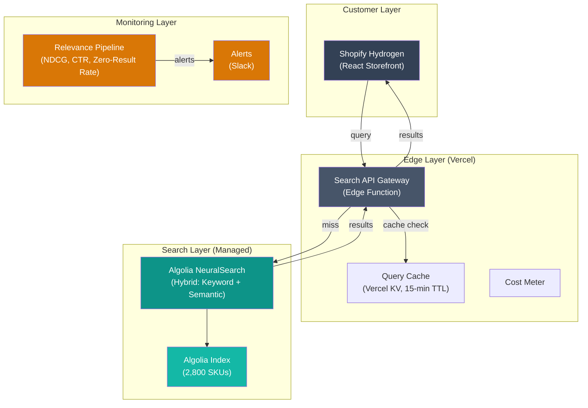

# Design Review 003: AI-Powered Semantic Product Search for a DTC E-Commerce Brand

---

| Dimension    | Value                    |
| ------------ | ------------------------ |
| System type  | Product                  |
| User surface | User-facing              |
| Latency      | Sync                     |
| Stakes       | Medium                   |
| Scale        | 1k–100k (8K queries/day) |
| Org maturity | No on-call               |

All claims in this design review are scoped to this context.

---

## 1. System Context & Constraints

Marcus Torres runs e-commerce for a $40M direct-to-consumer home goods brand. His search bar is the most valuable surface on the site — 23% of sessions use it, but those sessions generate 41% of revenue. Search users convert at 5.8%, nearly double the 3.2% rate for browsers. The problem is that search quality is silently eroding as the catalog grows.

Last quarter, the brand launched a "modern farmhouse" lighting collection — 48 SKUs, $180K in inventory. After four weeks, conversion on those products was 40% below the category average. The root cause was search: customers searching "farmhouse chandelier" or "rustic pendant light" found nothing because product titles used "transitional" and "artisan" instead. By the time the merchandising team added manual synonyms, $22K in markdowns had already been taken.

| Dimension | Value |
| --- | --- |
| Company | Hearthstone Home — $40M/year DTC home goods brand, Shopify Plus |
| Team | 2 full-stack developers (TypeScript/React, Node.js), 1 data analyst, no ML expertise |
| Search volume | 8,000 queries/day (~240K/month), Black Friday peak: 32K queries/day |
| Current pain | 40% of 2,800 SKUs have incomplete attributes; zero results for intent-based searches; $22K markdown loss from search-invisible products |
| Key data assets | Shopify product catalog, 18 months of search query logs (GA4), clickstream data |

The design question: **what's the cost/trust budget for semantic search?** Marcus must justify spending $36K/year on search infrastructure when the current system is free. But the "trust budget" is equally critical: with no relevance monitoring, the team cannot tell whether a search change is working, degrading, or breaking — and by the time conversion data is statistically significant (2–3 weeks), tens of thousands of dollars in revenue may have been silently lost.

---

## 2. What I Would Not Do

**Refusal 1: I would not build a custom vector search pipeline before fixing catalog data quality.**

If I were responsible for this system, the first thing I'd audit is the product data. Hearthstone has 40% of SKUs with incomplete attributes — missing style descriptors, inconsistent color names, absent room-type tags. Embedding models encode what's in the product data. If a minimalist lamp's description says only "18-inch lamp with adjustable arm," the embedding places it in generic lamp space — not near other modern furniture. The failure mode: building expensive search infrastructure on top of poor data, then blaming the search engine when the real problem is upstream. This refusal lifts if the catalog reaches 95%+ completeness on core attributes.

**Refusal 2: I would not deploy any search change without A/B testing against a holdout group.**

In this system — where search drives 41% of revenue and no relevance metrics exist — deploying a new search backend without a controlled experiment is flying blind. Research shows 99% of brands believe their search results are relevant, while 69% of consumers disagree ([Nosto, 2023](https://www.nosto.com/blog/new-search-research/)). The failure mode: deploy semantic search site-wide, conversion drops 8% because the new system handles head queries worse than 68 hand-tuned synonyms, and nobody knows for three weeks. This refusal lifts if the brand has an offline relevance evaluation suite with labeled query-product pairs.

**Refusal 3: I would not build custom embedding infrastructure when a managed platform covers 80% of the use case.**

A custom pipeline — OpenAI embeddings + Pinecone + hybrid retrieval logic — adds three new infrastructure dependencies the team has never operated. The failure mode: the initial implementation works, but when the embedding model is deprecated, or Black Friday query volume spikes and the vector DB throttles, there's no one who understands the system enough to respond. The managed alternative (Algolia with NeuralSearch) costs $246–$342/month and eliminates the operational overhead. This refusal lifts if measurable relevance benchmarks show a 15%+ improvement from custom embeddings over the managed platform.

---

## 3. Metrics & Success Criteria

The first step — before any infrastructure change — is establishing a relevance baseline. Hearthstone has none today.

| Metric | Target | Failure Signal |
| --- | --- | --- |
| NDCG@10 (offline) | ≥ 0.65 | Drops >5% from baseline on stable evaluation set |
| Zero-result rate | < 2% of queries | Exceeds 3% |
| Search conversion rate | ≥ 5.8% (current) | Drops below 5.2% for 2 consecutive weeks |
| Click-through rate (top 3) | ≥ 35% | Drops below 28% |
| Cost per 1,000 queries | < $0.15 | Exceeds $0.25 |

| Target | Value | Rationale |
| --- | --- | --- |
| P95 latency | < 300ms | Shopify native renders in ~150ms; 300ms is the maximum before users perceive delay |
| Availability | 99.9% | 8.7 hrs/yr downtime; every minute of search downtime costs ~$11 in lost revenue |

---

## 4. Data Strategy

The data quality problem is the most important thing to address before any search infrastructure work. Applying the Data Foundation Test: 40% of 2,800 SKUs (1,120 products) have incomplete attributes. These products are partially invisible to any search system because the attributes customers search by aren't in the data.

The catalog breaks into three quality tiers. The top tier (~60%, 1,680 SKUs) has complete attributes — these benefit immediately from better search. The middle tier (~25%, 700 SKUs) has adequate descriptions but inconsistent tags — visible in semantic search but invisible in filtered results. The bottom tier (~15%, 420 SKUs) has minimal descriptions — nearly invisible to any approach.

**Attribute standardization**: Define a controlled vocabulary — 8 style categories, 12 color families (mapped from 47 current names), 6 material groups, 8 room types. Apply rules-based mapping to existing data. Estimated effort: 4–6 weeks of data analyst time staged by category, ~$3,000–$5,000 in labor. For the 420 minimally-described SKUs, use LLM-assisted enrichment (GPT-4o-mini at $0.15/1M input tokens) with mandatory merchandising team review — total cost ~$0.10 for the batch.

| Data Source | Quality | Freshness | Drift Risk |
| --- | --- | --- | --- |
| Shopify product catalog | Medium (60% complete attributes) | Real-time via API; ~400 new SKUs/quarter | Medium — seasonal vocabulary gaps |
| Search query logs (GA4) | Medium (queries captured, no relevance judgments) | Daily export | Low — core vocabulary stable |
| Product images | High | Static per product | Low |

**Primary drift concern**: Vocabulary drift — new product lines introduce terminology absent from the search space. "Modern farmhouse" was a vocabulary gap that cost $22K. Mitigation: re-index quarterly and monitor zero-result rate daily.

---

## 5. Architecture & Data Flow

The recommended architecture is a managed hybrid search platform (Algolia) with a lightweight relevance monitoring layer — not a custom embedding pipeline. At 240K queries/month, Algolia's pricing lands at approximately $246–$342/month — well within the $3,000 budget and far below a custom pipeline's total cost of ownership when engineering time is factored in.

| Component | Budget | Notes |
| --- | --- | --- |
| Query preprocessing + cache check | 10ms | Edge function + KV lookup |
| Algolia API (cache miss) | 150ms | NeuralSearch hybrid retrieval |
| Result processing + A/B assignment | 5ms | Hash computation |
| Network overhead | 80ms | Edge → Algolia → Edge → client |
| **Total (cache miss)** | **245ms** | **SLO: 300ms P95** |
| **Total (cache hit)** | **30ms** | ~20% of queries (long-tail heavy) |

---

## 6. Failure Modes & Detection

| Failure Mode | Severity | Detection Signal | Detection Latency | Silent? |
| --- | --- | --- | --- | --- |
| **Relevance degradation** — results plausible but poorly ranked | High | NDCG drop >5%; top-3 CTR decline >20% WoW | 1–3 weeks | **Yes** |
| **Zero-result explosion** — vocabulary gaps cause empty results | High | Zero-result rate >3% | Hours to days | Partially |
| **Catalog sync failure** — Algolia index stale | Medium | Record count divergence; last-sync >8 hrs | 4–8 hours | Partially |
| **Cost blowup** — query spike exceeds budget | Medium | Cost/1K queries >$0.25 | Hours | No |
| **Partial index served** — stale replica during partition | Low | Record-count reconciliation delta >1% | Hours to 1 day | **Yes** |
| **A/B test contamination** — variant assignment leaks | Low | Distribution drift >55/45 | Days to weeks | **Yes** |

Relevance degradation is the failure mode that matters most. The system returns 24 products for "blue accent lamp," latency is 180ms, no errors fire — but the customer wanted a blue lamp, not a blue pillow and a silver lamp. They leave without complaining. The dashboard shows green. Conversion drifts down 3% over two weeks, indistinguishable from seasonal variance.

The detection strategy has three layers: weekly NDCG evaluation on 200 labeled query-product pairs (catches shifts within 7 days), daily zero-result rate and top-3 CTR (catches acute failures), and weekly search conversion rate (catches business impact with 2–3 week lag). No single metric is sufficient; together they reduce maximum detection latency from "never" to approximately one week.

---

## 7. Mitigations & Deployment

| Failure Mode | Mitigation | Rollback Plan |
| --- | --- | --- |
| Relevance degradation | Weekly NDCG evaluation; A/B test all ranking changes | Revert to previous Algolia configuration |
| Zero-result explosion | Daily monitoring; automated synonym suggestion queue | Additive — add synonyms |
| Catalog sync failure | Sync health alerts (>8 hr threshold); record-count reconciliation | Full catalog re-sync (~10 min) |
| Cost blowup | Cost metering with threshold alerts; degrade to keyword-only if approaching cap | Disable NeuralSearch via dashboard |

**Deployment phases**:

- **Phase 0 (Weeks 1–3)**: Fix catalog data. Attribute standardization, controlled vocabulary, LLM-assisted enrichment for bottom-tier SKUs. Target: 90%+ completeness.
- **Phase 1 (Weeks 3–6)**: Algolia MVP on lighting category only (620 SKUs). A/B test against Shopify native search. Build relevance monitoring.
- **Phase 2 (Weeks 6–10)**: Expand to all categories if lighting shows ≥5% conversion lift (p<0.05).
- **Phase 3 (Weeks 10–12)**: Full production. Activate all monitoring. Black Friday readiness testing.

**Graceful degradation**: If Algolia is unavailable, the search gateway falls back to Shopify's native search via circuit breaker (triggers after 5 minutes of errors). Users get worse results, but they get results.

---

## 8. Cost Model

| Component | Unit Cost | Monthly Cost |
| --- | --- | --- |
| Algolia Search Requests (NeuralSearch) | $1.00–$1.50/1K requests | $192–$288 |
| Algolia Records | $0.40/1K records | $1.12 |
| Algolia Data Operations | $1.00/1K ops | $21 |
| Vercel (Pro + KV) | — | $26 |
| LLM enrichment (quarterly) | $0.15/1M tokens | ~$0.03 |
| **Total infrastructure** | | **$246–$342/month** |
| Relevance evaluation (analyst labor) | | ~$400/month |
| **Total with labor** | | **$646–$742/month** |

**Budget utilization**: 21–25% of $3,000/month ceiling.

| Scale Tier | Monthly Cost | What Changes |
| --- | --- | --- |
| Current (8K/day) | $246–$342 | Baseline |
| 10x (80K/day) | $1,960–$2,900 | Cache optimization critical; negotiate volume pricing |
| Black Friday (32K/day, 3 days) | +$30–$45 spike | No architectural change; pre-warm cache |

**Custom pipeline alternative**: Infrastructure costs just $20/month (OpenAI embeddings + Pinecone free tier), but year-one total cost of ownership — including 4–6 weeks of build effort at $75/hr and ongoing operations — is **$38K–$51K vs. $7,752–$8,904 for Algolia**. The managed platform is 4–6x cheaper in year one.

### Cost Validation

| Cost Line Item | Published Source | Match? |
| --- | --- | --- |
| Algolia Search ($1.00–$1.50/1K) | [Algolia Pricing](https://www.algolia.com/pricing) | Yes |
| OpenAI embedding ($0.02/1M tokens) | [OpenAI Pricing](https://platform.openai.com/docs/pricing) | Yes |
| Pinecone Starter (free, 2GB) | [Pinecone Pricing](https://www.pinecone.io/pricing/estimate/) | Yes |
| Vercel Pro ($20/month) | [Vercel Pricing](https://vercel.com/pricing) | Yes |

---

## 9. Security & Compliance

**Search query privacy**: Queries can contain PII (names, addresses). Under CCPA, queries linked to user identity are personal information. Mitigation: execute DPAs with both Algolia (SOC 2 Type II) and Vercel; scrub PII from query logs before relevance evaluation; aggregate logs older than 90 days.

**Edge log PII**: Queries routed through Vercel Edge Functions are logged with IP and headers. Vercel must be treated as a data processor under CCPA with a DPA and log redaction configured.

**Adversarial risk**: Minimal — Algolia's NeuralSearch uses pre-computed embeddings, not generative AI at query time. No system prompt to inject. Rate limiting (10 queries/second per IP) and query length caps (200 characters) mitigate cost-based abuse.

**Access control**: Algolia Admin API keys stored as Vercel environment variables, never in frontend code. Only Search API key (read-only, rate-limited) exposed in Hydrogen storefront.

---

## 10. What Would Change My Mind

Three conditions would shift the recommendation from managed platform to custom embedding pipeline:

**1. Domain-specific embeddings outperform by 15%+ on NDCG.** If fine-tuned models capture Hearthstone's style taxonomy ("transitional" vs. "modern farmhouse") significantly better than Algolia's built-in semantic search, the relevance improvement may justify operational complexity.

**2. Catalog growth pushes Algolia costs past $2,000/month.** At 10K+ SKUs and 80K+ queries/day, a custom pipeline with Pinecone free tier and OpenAI embeddings costs under $50/month in infrastructure — favorable if the team has developed ML ops capability by then.

**3. Algolia fails on domain-specific vocabulary.** If after 8 weeks of production use, zero-result rate hasn't dropped below 2% and NDCG hasn't improved 10%+ over the Shopify baseline, the managed platform isn't solving the core problem.

I'm uncertain about A/B testing power at this traffic level. A 50/50 split on 8K queries/day may not reach significance for 3–4 weeks. The correct response is extending the test — not skipping it. A 90/10 split can serve as ongoing monitoring after the initial decision.

---

## Sources

**Industry & Market**
- [Nosto — Why 69% of Shoppers Use Search](https://www.nosto.com/blog/new-search-research/) — Search adoption, relevance gap between brand perception and consumer experience
- [Opensend — On-Site Search Conversion Statistics](https://www.opensend.com/post/on-site-search-conversion-rate-statistics-ecommerce) — Search users convert 2–3x higher, account for ~50% of revenue
- [Ecommerce Fastlane — Product Architecture Framework](https://ecommercefastlane.com/product-architecture-framework/) — DTC catalog scaling challenges and conversion impact

**Vendor & Pricing**
- [Algolia Pricing](https://www.algolia.com/pricing) — Grow tier search request and record pricing
- [OpenAI Pricing](https://platform.openai.com/docs/pricing) — Embedding and inference model pricing
- [Pinecone Pricing](https://www.pinecone.io/pricing/estimate/) — Vector database tier pricing
- [Vercel Pricing](https://vercel.com/pricing) — Edge Functions and KV pricing
- [OpenMetal — Self-Hosting Vector DB Breakeven](https://openmetal.io/resources/blog/when-self-hosting-vector-databases-becomes-cheaper-than-saas/) — Managed vs. self-hosted cost analysis
