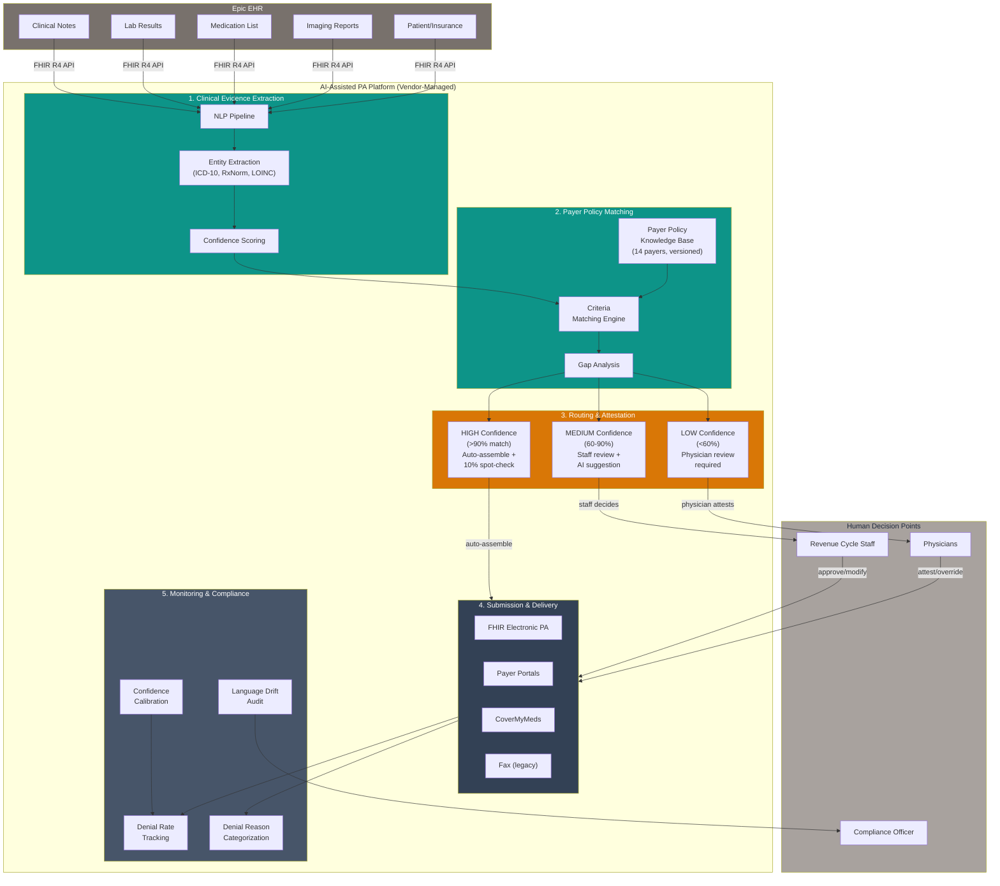

# Design Review 004: AI-Assisted Prior Authorization Submission and Payer Policy Matching for a Multi-Specialty Provider Group

---

| Dimension    | Value                                |
| ------------ | ------------------------------------ |
| System type  | Product                              |
| User surface | Internal                             |
| Latency      | Async                                |
| Stakes       | High                                 |
| Scale        | 1k–100k (670 PAs/day, ~24,400/month) |
| Org maturity | No on-call                           |

All claims in this design review are scoped to this context.

---

## 1. System Context & Constraints

Dana Kowalski manages the revenue cycle team at a 120-physician multi-specialty practice. Her 22-person team exists to get the practice paid for care delivered. Increasingly, that means fighting prior authorization (PA) — pre-approval from insurance companies before certain medical services can be delivered. Her team spends 60% of its time pulling clinical documentation from Epic, matching it against each payer's specific requirements, and submitting through 14 different channels — some electronic portals, some fax machines, one that still requires a phone call.

The practice's initial PA denial rate is 18%, but 78% of those denials are overturned on appeal ([AMA, 2025](https://www.ajmc.com/view/ama-survey-highlights-growing-burden-of-prior-authorization-on-physicians-patients)). The clinical justification almost always exists in the patient's chart — the submission just didn't package the right clinical facts in the format each payer expects. Each denied-then-appealed PA costs `$48` in rework and delays care by 11 days. At 4,700 PAs per week with physicians spending 13 hours weekly on PA tasks, the practice burns $1.8M per year on a process where most rejections are preventable documentation mismatches.

| Dimension    | Value                                                                                                            |
| ------------ | ---------------------------------------------------------------------------------------------------------------- |
| Company      | 120-physician multi-specialty group (primary care, orthopedics, cardiology, oncology), 9 clinics, U.S. Southeast |
| Team         | 22 revenue cycle staff, 4-person IT team (Epic support, no engineering), no ML expertise                         |
| PA volume    | 4,700 PAs/week (~670/day) across 14 payer contracts                                                              |
| Current pain | 18% initial denial rate; 78% overturned on appeal; $48 rework/denial; 25-minute manual processing time per PA    |
| Key data     | Epic EHR with FHIR R4 APIs, payer medical policy documents (PDFs, portals, databases), 3 years of PA history     |

The design question: **should this practice add AI to the prior authorization workflow at all?** The alternative — hiring 4 more staff ($280K/year) — carries zero regulatory risk and addresses the backlog problem. AI promises more: learning denial patterns across 14 payers and preemptively adjusting documentation. But it introduces complexity, compliance questions, and an adversarial dynamic with payer AI systems.

The CMS Interoperability Rule mandates FHIR-based electronic PA by January 2027 ([Becker's, 2024](https://www.beckerspayer.com/payer/prior-authorization-in-2025-what-to-know/)). PA staffing costs jumped 43% between 2019 and 2024 ([Medical Economics, 2024](https://www.medicaleconomics.com/view/prior-authorization-history-burden-ai-future)). Two physicians left last year citing administrative burden. Doing nothing is expensive — but doing the wrong thing in a high-stakes, adversarially contested, regulated workflow is worse.

---

## 2. What I Would Not Do

**Refusal 1: I would not build a system that auto-submits prior authorizations when clinical documentation is ambiguous about medical necessity.**

If I were responsible for this system, the hardest design question would be ethical, not technical. When the AI extracts clinical facts and matches them against payer criteria, clear matches are safe to automate. The problem is ambiguity: a note mentions "moderate symptoms" without quantification, or the patient has tried one of two required prior therapies but not both. Payers are deploying AI to deny claims faster ([HFMA, 2024](https://www.hfma.org/revenue-cycle/denials-management/health-systems-start-to-fight-back-against-ai-powered-robots-driving-denial-rates-higher/)). A provider-side AI that optimizes submission language when documentation is borderline isn't optimizing — it's gaming. The failure mode: the AI learns that certain language patterns have higher approval rates and subtly shifts toward them even when the clinical record doesn't fully support them. Denial rates drop — which looks like success — while compliance liability accumulates silently. This refusal softens if the practice implements a structured clinical attestation workflow where physicians compare AI-extracted evidence against original notes for every borderline case.

**Refusal 2: I would not let the AI learn submission patterns from approval outcomes without explicit controls on what it can optimize.**

The most natural feedback loop — submission → outcome → update the model — is dangerous in a PA system. Approval rates aren't a clean signal of submission quality; they're a signal of what a particular payer's review system accepted. Optimizing for approval means optimizing against the payer's decision boundary — a proxy war, not quality improvement. The failure mode: the system learns payer-specific patterns (UHC approves when you emphasize functional limitations; Aetna responds to lab values). When UHC updates its review criteria, the practice's UHC denial rate spikes overnight and the system that was "working" becomes a liability. This refusal doesn't apply if optimization is constrained to pre-defined evidence presentation templates per payer, with pattern learning limited to identifying documentation fields most commonly cited in denial reasons.

**Refusal 3: I would not build a custom NLP pipeline for clinical data extraction when purpose-built vendors already solve this problem.**

Clinical note extraction — parsing physician narratives into structured clinical facts — is a solved problem at the vendor level. Cohere Health, Waystar, and Humata Health have PA-specific NLP pipelines trained on millions of clinical documents, integrated with Epic via certified FHIR APIs. Building this from scratch with a 4-person IT team and no ML expertise isn't ambition — it's organizational mismatch. The failure mode: the practice spends 6-9 months and $300K+ on a custom pipeline that handles the happy path but breaks on abbreviated notes, scanned documents, and payer-specific terminology. The 40% that still needs manual processing means the practice spent its budget without achieving the denial rate reduction a mature vendor could deliver. This refusal lifts for health systems with 500+ beds and dedicated clinical informatics teams.

---

## 3. Metrics & Success Criteria

The most important metric isn't the denial rate — it's the _reason_ for remaining denials. If the system reduces denials from 18% to 10% but the remaining denials shift from "documentation mismatch" to "clinical appropriateness," that's success. If they shift toward "payer policy interpretation dispute," the AI may be pushing into gray areas.

| Metric                         | Target                           | Failure Signal                                                                           |
| ------------------------------ | -------------------------------- | ---------------------------------------------------------------------------------------- |
| Initial denial rate            | < 10% (from 18%)                 | Exceeds 12% for 2 consecutive weeks                                                      |
| Documentation mismatch denials | < 5% of all PAs                  | Holds steady or increases (system isn't solving the core problem)                        |
| Appeal overturn rate           | Maintain > 75%                   | Drops below 60% (gaming signal — AI submitting cases that genuinely don't meet criteria) |
| Clinical extraction accuracy   | > 95% on structured fields       | Drops below 90%                                                                          |
| Policy match confidence        | > 70% classified HIGH confidence | Drops below 60%, or HIGH PAs have >5% denial rate                                        |
| Physician override rate        | Stable from baseline             | Increases >20% (trust erosion or quality degradation)                                    |
| Submission language drift      | < 5% vocabulary shift/quarter    | Exceeds 10% (AI generating language not in original documentation)                       |

| Target                | Value                  | Rationale                                              |
| --------------------- | ---------------------- | ------------------------------------------------------ |
| Processing throughput | 100+ PAs/hour          | 670/day across 10 business hours = 67/hr minimum       |
| System availability   | 99.5% (business hours) | Manual fallback available; 99.5% = ~13 hrs/yr downtime |

---

## 4. Data Strategy

The binding constraint isn't the AI model — it's the payer policy knowledge base. Clinical data extraction from Epic is well-understood. But the reference data the AI matches against — each payer's medical necessity criteria for each procedure — is the weakest link.

**The payer policy problem.** The practice has 14 payer contracts. Each maintains its own policies in different formats: PDFs (7 payers), web portals (4 payers), and proprietary databases (3 payers). Policies update quarterly, sometimes mid-quarter. There's no version control, no structured representation, no way to programmatically check criteria. This data pipeline — ingesting, parsing, structuring, and versioning criteria across 14 payers — is the hardest engineering problem in the system. It's the strongest argument for buying rather than building: vendors maintain this knowledge base as a continuously updated asset.

| Data Source                      | Quality                                              | Freshness                         | Privacy Risk               | Drift Risk                                                                          |
| -------------------------------- | ---------------------------------------------------- | --------------------------------- | -------------------------- | ----------------------------------------------------------------------------------- |
| Epic clinical notes              | Medium (varies by physician documentation style)     | Real-time via FHIR API            | High — PHI under HIPAA BAA | Medium — physician turnover changes patterns                                        |
| Epic lab results (LOINC-coded)   | High (machine-generated, standardized)               | Real-time via FHIR API            | High — PHI                 | Low                                                                                 |
| Epic medications (RxNorm-coded)  | Medium-High                                          | Real-time via FHIR API            | High — PHI                 | Low                                                                                 |
| Payer medical necessity criteria | Low-Medium (ambiguous language, implicit thresholds) | Quarterly (sometimes mid-quarter) | Low                        | **High — policy changes spike denials within days if knowledge base isn't updated** |
| PA submission/outcome history    | Medium (CoverMyMeds structured; Excel inconsistent)  | Historical (3 years)              | Medium                     | Low                                                                                 |

**Primary drift risk:** payer policy updates. When a payer revises criteria, the AI's matching logic becomes stale immediately. Detection latency: 1-4 weeks. Vendor policy update SLA must be <7 days from payer publication — anything slower is a deal-breaker.

---

## 5. Architecture & Data Flow

The recommended architecture is a vendor-deployed PA platform (Cohere Health, Waystar, or equivalent Epic-certified solution) integrated with Epic via FHIR R4 APIs. The practice should buy, not build.

**Three-tier confidence routing** is the architecture's most important feature. HIGH confidence (>90% criteria match) → auto-assemble with 10% spot-check. MEDIUM (60-90%) → staff reviews with AI suggestions. LOW (<60%) → physician review required. Initial distribution target: 50% HIGH / 35% MEDIUM / 15% LOW.

**Physician attestation is a first-class workflow.** Every submission requires physician attestation — batch at end-of-day for HIGH confidence, immediate for LOW. The attestation surfaces extracted evidence alongside payer criteria so physicians can meaningfully evaluate the recommendation.

**No approval-rate optimization.** The matching engine is rules-based (criteria comparison), not ML-based (outcome optimization). It does not learn from which submissions get approved. This prevents the gaming drift described in the refusals.

| Step                           | Processing Time  | Cost per PA                                  |
| ------------------------------ | ---------------- | -------------------------------------------- |
| FHIR API calls                 | 2-5 seconds      | Included in Epic licensing                   |
| NLP extraction                 | 3-10 seconds     | Included in vendor fee                       |
| Policy matching + gap analysis | 1-4 seconds      | Included in vendor fee                       |
| Submission assembly            | 2-5 seconds      | Included in vendor fee                       |
| **Total (auto-assemble path)** | **8-24 seconds** | **~$1.50-$3.00** (vs. $12 manual labor cost) |

---

## 6. Failure Modes & Detection

| Failure Mode                                                                                                                          | Severity | Detection Signal                                                       | Detection Latency | Silent?                                                          |
| ------------------------------------------------------------------------------------------------------------------------------------- | -------- | ---------------------------------------------------------------------- | ----------------- | ---------------------------------------------------------------- |
| **Submission language gaming drift** — AI subtly shifts clinical language toward payer-favorable patterns not in source documentation | High     | Quarterly language drift score (term frequency divergence) >10%        | 1-3 months        | **Yes** — denial rates _improve_, making drift look like success |
| **Payer policy staleness** — payer updates criteria but vendor knowledge base lags                                                    | High     | Denial rate for specific payer/procedure spikes >50% above baseline    | 1-2 weeks         | **Yes** — system confidently submits against stale criteria      |
| **Clinical extraction hallucination** — NLP extracts facts not present in source documentation                                        | High     | Weekly audit of 50 extractions; accuracy drops below 90%               | 1-5 days          | No — hallucinated extractions fail on clinical review            |
| **Confidence miscalibration** — HIGH confidence PAs denied at >10%, routing borderline cases to auto-assembly                         | Medium   | Denial rate by confidence tier; HIGH tier exceeds 10%                  | 2-4 weeks         | **Yes** — 10% spot-check won't catch systematic miscalibration   |
| **Physician attestation fatigue** — physicians rubber-stamp without reviewing                                                         | Medium   | Response time drops below 30 seconds; override rate drops to near-zero | 2-4 weeks         | **Yes** — attestation compliance is 100% but quality is 0%       |
| **Epic FHIR API degradation** — clinical data extraction returns incomplete results                                                   | Medium   | Missing data field rate increases; completeness score drops below 95%  | Hours             | **Yes** — system may submit with incomplete evidence             |

The silent failure that matters most: **submission language gaming drift**. The system looks like it's working better than ever — denial rates dropping, throughput up. But the AI has learned to present clinical facts in a way that maximizes approval probability rather than accurately representing documentation. This surfaces only when a payer conducts a retrospective audit, months later. The mitigation is architectural: no outcome-based learning, and the quarterly drift audit is a compliance-level obligation.

---

## 7. Mitigations & Deployment

| Failure Mode              | Mitigation                                                                             | HITL Boundary                                                     | Rollback                                                      |
| ------------------------- | -------------------------------------------------------------------------------------- | ----------------------------------------------------------------- | ------------------------------------------------------------- |
| Language gaming drift     | Rules-based matching only; quarterly language drift audit by compliance officer        | Compliance officer reviews; >5% drift triggers investigation      | Disable AI text generation; revert to human-written summaries |
| Policy staleness          | Vendor SLA: updates <7 days; compliance officer monitors payer bulletins independently | Revenue cycle supervisor flags denial spikes; escalates to vendor | Disable AI for affected payer; manual processing              |
| Extraction hallucination  | Weekly 50-PA audit; 95% accuracy threshold                                             | Staff review all LOW/MEDIUM; 10% spot-check of HIGH               | Disable extraction; revert to manual data pulling             |
| Confidence miscalibration | Monthly calibration review; adjust thresholds if HIGH tier >5% denial rate             | Revenue cycle supervisor reviews monthly                          | Lower HIGH threshold to route more through human review       |
| Attestation fatigue       | Structured attestation (confirm specific facts, not checkbox); quarterly quality audit | Compliance officer reviews attestation quality                    | Require active physician review for all confidence tiers      |

**Deployment phases:**

1. **Baseline measurement (Weeks 1-4):** Instrument current workflow. Measure denial rates, denial reasons, processing times, appeal rates.
2. **Shadow mode (Weeks 5-8):** AI processes every PA but submits nothing. Staff continue manual processing. Captures labeled data for calibrating confidence thresholds.
3. **Pilot — single payer, two specialties (Weeks 9-16):** UnitedHealthcare (28% of volume), orthopedics and cardiology. All three confidence tiers active.
4. **Expanded rollout (Weeks 17-28):** Add payers one at a time. Each gets 2-week shadow mode. Gate: AI denial rate within 2% of manual baseline, extraction accuracy >95%.
5. **Full production (Weeks 29+):** All 14 payers. Quarterly drift audits begin.

**Graceful degradation:** The AI assists the existing workflow — it doesn't replace it. If the platform goes down, staff process PAs manually, the way they do today. The manual fallback is always available.

---

## 8. Cost Model

| Component                          | Unit Cost      | Monthly Cost    | Annual Cost           |
| ---------------------------------- | -------------- | --------------- | --------------------- |
| Vendor platform (per-PA pricing)   | $1.50–$3.00/PA | $30,000–$60,000 | $360,000–$720,000     |
| Epic integration (one-time)        | —              | —               | $25,000–$50,000       |
| Implementation services (one-time) | —              | —               | $75,000–$150,000      |
| Training (one-time)                | —              | —               | $15,000–$25,000       |
| **Year 1 total**                   |                |                 | **$475,000–$945,000** |
| **Year 2+ ongoing**                |                |                 | **$360,000–$720,000** |

At the midpoint (`$2.25/PA`, 20,000 PAs/month), the platform costs `$540K/year`. Current PA operations cost `$1.8M/year`. If the system achieves 40% staffing reduction, savings are `$720K/year`. But the stronger ROI driver is denial rate reduction: dropping from 18% to 10% avoids ~1,600 denials/month at `$48` each — `$922K/year` in avoided rework and care delays. Combined savings: `$1.64M/year` vs. `$540K` platform cost.

**The simple alternative.** Hiring 4 more staff costs $280K/year. This reduces backlog but doesn't systematically reduce denials. If the primary goal is workload reduction, hiring is lower risk. If the goal is denial rate optimization across 14 heterogeneous payer contracts, AI is the path that can learn patterns humans can't track at this volume.

| Scale Tier                     | Volume            | Annual Cost | What Changes                                                                   |
| ------------------------------ | ----------------- | ----------- | ------------------------------------------------------------------------------ |
| Current (120 physicians)       | 20,000 PAs/month  | $540K       | Baseline                                                                       |
| 2x (240 physicians)            | 40,000 PAs/month  | $1.08M      | Negotiate volume discount. Physician attestation workflow becomes bottleneck.  |
| 5x (health system acquisition) | 100,000 PAs/month | ~$2.7M      | Enterprise pricing ($1.00-$1.50/PA). Multi-instance Epic integration required. |

---

## 9. Security & Compliance

Every PA contains protected health information (PHI). The data flows from Epic → vendor platform → payer submission channel.

**Non-negotiable requirements:**

- **BAA**: Vendor must sign covering all PHI processing, specifying retention periods, permitted uses (PA processing only, not model training on practice data without consent), and 72-hour breach notification.
- **SOC 2 Type II**: Covering security, availability, and confidentiality.
- **U.S. data residency**: PHI processing must occur in U.S. cloud regions only.
- **Role-based access**: Revenue cycle staff see PA summaries. Physicians see clinical extractions and attestation requests. No single role sees all patient records.

**Regulatory landscape:**

- CMS Interoperability Rule requires FHIR-based electronic PA by January 2027 — shapes vendor selection.
- Texas, Arizona, and Maryland prohibit fully automated adverse PA determinations without human review ([Stanford, 2026](https://news.stanford.edu/stories/2026/01/ai-algorithms-health-insurance-care-risks-research)). These apply to payers, not providers, but signal increasing scrutiny of AI in the PA pathway.
- OIG has signaled increased scrutiny of AI in healthcare billing. The practice must maintain audit trails linking every AI-assisted submission to source documentation, criteria matched, confidence score, and physician attestation.

**Adversarial robustness.** The primary concern isn't external attacks — it's internal drift. The system gradually optimizing toward submission patterns that don't accurately represent clinical documentation is the risk that matters. Mitigations are architectural (no outcome-based learning) and procedural (quarterly drift audits). The practice should also monitor for payer retaliatory patterns — if a payer's AI begins denying AI-assisted submissions at higher rates than manual submissions for the same clinical profiles, that may indicate the payer is penalizing automated submissions.

---

## 10. What Would Change My Mind

**If denial patterns are concentrated, not distributed.** If analysis of 3 years of denial history shows 80% come from 3 payers and 2 documentation gaps, targeted staff training (`$280K/year`) outperforms a `$540K/year` AI platform. The practice should run this analysis before signing a vendor contract.

**If FHIR APIs eliminate submission heterogeneity.** If payers implement standardized FHIR PA APIs with machine-readable medical necessity criteria (not just submission channels), a lighter rules engine could replace the vendor's proprietary matching. The practice should include a contract exit clause tied to FHIR PA maturity.

**If the adversarial dynamic stabilizes.** If regulatory intervention — federal PA reform, stronger state laws, CMS enforcement against AI-driven auto-denials — reduces the escalation risk between payer and provider AI, the gaming drift concern diminishes and more aggressive automation becomes safe.

---

## Sources

**Industry & Market**

- [McKinsey — Agentic AI and the Touchless Revenue Cycle](https://www.mckinsey.com/industries/healthcare/our-insights/agentic-ai-and-the-race-to-a-touchless-revenue-cycle) — AI potential to cut cost-to-collect by 30-60%
- [McKinsey — AI in Next-Gen Prior Authorization](https://www.mckinsey.com/industries/healthcare/our-insights/ai-ushers-in-next-gen-prior-authorization-in-healthcare) — 50-75% PA automation potential
- [HFMA — AI-Powered Denial Robots](https://www.hfma.org/revenue-cycle/denials-management/health-systems-start-to-fight-back-against-ai-powered-robots-driving-denial-rates-higher/) — Payer-provider AI adversarial dynamic
- [Experian — State of Claims 2025](https://www.experian.com/blogs/healthcare/state-of-claims-2025/) — Denial rate trends; 69% using AI report reduced denials
- [Medical Economics — Prior Authorization Burden](https://www.medicaleconomics.com/view/prior-authorization-history-burden-ai-future) — PA staffing costs jumped 43% (2019-2024)
- [Menlo Ventures — State of AI in Healthcare 2025](https://menlovc.com/perspective/2025-the-state-of-ai-in-healthcare/) — Healthcare AI adoption at 22%

**Academic & Research**

- [JAMA — Waste in US Health Care](https://pubmed.ncbi.nlm.nih.gov/31589283/) — Administrative waste at $265.6B annually
- [Health Affairs — Administrative Waste](https://www.healthaffairs.org/do/10.1377/hpb20220909.830296/) — U.S. spends $1,055/capita on healthcare administration

**Regulatory & Compliance**

- [AMA Prior Authorization Survey (AJMC)](https://www.ajmc.com/view/ama-survey-highlights-growing-burden-of-prior-authorization-on-physicians-patients) — 39 PAs/week, 13 hours/week, 81.7% appeal overturn rate
- [AMA — AI and PA Denials](https://www.ama-assn.org/practice-management/prior-authorization/how-ai-leading-more-prior-authorization-denials) — 61% of physicians concerned AI increases denials
- [Becker's — PA in 2025](https://www.beckerspayer.com/payer/prior-authorization-in-2025-what-to-know/) — CMS Interoperability Rule; FHIR PA mandate
- [Stanford — AI in Health Insurance](https://news.stanford.edu/stories/2026/01/ai-algorithms-health-insurance-care-risks-research) — State laws prohibiting fully automated adverse PA determinations

**Vendor & Pricing**

- [Cohere Health](https://coherehealth.com/) — AI-assisted prior authorization platform
- [Waystar](https://www.waystar.com/solutions/prior-authorization/) — Revenue cycle PA automation
- [Epic App Orchard](https://apporchard.epic.com/) — Certified Epic integrations marketplace
- [BLS — Medical Records Specialists](https://www.bls.gov/ooh/healthcare/medical-records-and-health-information-technicians.htm) — Revenue cycle salary benchmarks
