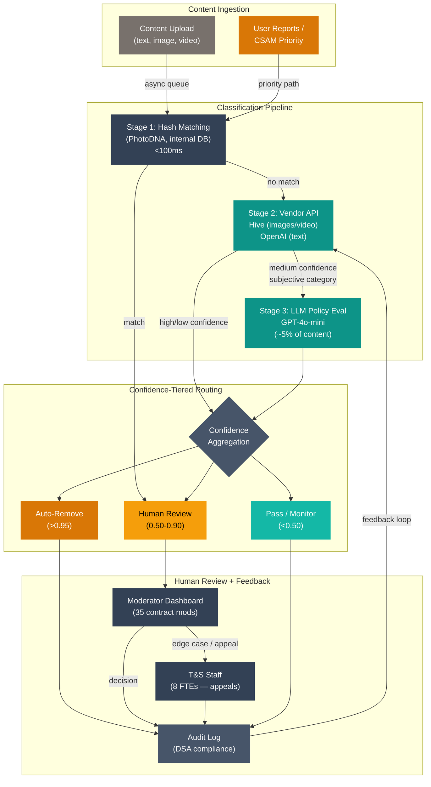

# Design Review 005: Adaptive Content Classification with Policy-as-Code and Human-in-the-Loop Escalation

---

| Dimension    | Value                                         |
| ------------ | --------------------------------------------- |
| System type  | Platform                                      |
| User surface | Internal (with user-facing consequences)      |
| Latency      | Async (with near-real-time tier)              |
| Stakes       | High                                          |
| Scale        | 1k–100k (850K items/day, growing to 2.1M/day) |
| Org maturity | On-call exists                                |

All claims in this design review are scoped to this context.

---

Priya Okonkwo is the VP of Trust & Safety at Mosaic, a social platform for creator communities with 2 million daily active users across the U.S. and Western Europe. Her overnight moderation report tells the same story every morning: auto-removals climbing (the system is getting more aggressive), the review queue growing faster than her team can drain it (15% weekly growth), and creator complaints tripled year-over-year. Digital artists — the platform's core demographic — are publicly migrating to a competitor because keyword-based filters keep removing legitimate artwork. The false positive rate on automated actions is 38%.

The system Priya inherited is a 2023-vintage keyword filter paired with a static image classifier, now buckling under three pressures. The EU's Digital Services Act (DSA) requires transparency reports, appeal mechanisms, and accuracy standards ([EU DSA](https://digital-strategy.ec.europa.eu/en/policies/digital-services-act)) — and Mosaic's system can't explain why it removed something. Short-form video launched with no proactive moderation. Content volume is growing 25% QoQ while the CEO has capped the T&S budget.

What Priya needs is not a better classifier — that's what vendors keep pitching. She needs the infrastructure around the classifier: policy deployment without 4-6 week retraining cycles, confidence-tiered routing to human reviewers, DSA-compliant appeal workflows, and monitoring that catches degradation before creators notice. The classifier is the easy part. Everything else is the design problem.

---

## 1. System Context & Constraints

| Dimension    | Value                                                                                                                                                                                                 |
| ------------ | ----------------------------------------------------------------------------------------------------------------------------------------------------------------------------------------------------- |
| Company      | Mosaic — creator-focused social platform, Series C, 2M DAU / 15M MAU, U.S. and Western Europe.                                                                                                        |
| Users        | 2M DAU creating/consuming text posts, images, short-form video (<3 min), comments across English, Spanish, French, German. Core demographic: digital artists, photographers, writers.                 |
| T&S team     | 8 FTEs (VP, 2 policy specialists, 3 ops leads, 2 data analysts) + 35 contract moderators across 2 BPO vendors. No ML engineers.                                                                       |
| Volume       | 850K pieces of content/day. Growing 25% QoQ. ~12,000 manual reviews/day.                                                                                                                              |
| Current pain | 38% false positive rate on automated removals. 14-hour average response on user reports. Creator complaints tripled YoY. 15% of top-100 creators left in past quarter. No proactive video moderation. |
| ML expertise | 2 data analysts (SQL, Python — no model training). 30 engineers (full-stack, no ML). 2023 image classifier built by external contractor, deployed as static Docker container. No ML platform.         |

The primary question is whether to replace the failing keyword-and-static-classifier approach with ML-based adaptive classification — and whether the infrastructure investment is justified at this scale and maturity. The simpler alternative — investing $400K-$600K in doubling the contract moderator workforce — avoids ML risk but can't solve the false positive problem (keyword filters are fundamentally limited for distinguishing artistic nudity from explicit content) and can't scale with 25% QoQ growth without proportional headcount growth.

Reliability requirements are asymmetric by category: CSAM and self-harm require near-zero false negatives even at the cost of aggressive false positives, while artistic content requires low false positives even at the cost of higher false negatives — wrongful removal of art is the failure mode driving creator migration.

---

## 2. What I Would Not Do

**I would not build custom classifiers in-house.**

If I were responsible for this system, I would not have a 30-person engineering team with zero ML experience build content classification models. Vendor APIs are trained on billions of labeled examples across thousands of platforms — Meta's classifiers detect 97% of terrorist content before human review ([Meta Transparency Center](https://transparency.meta.com/reports/)). The failure mode: 6-12 months building infrastructure vendors already provide, while the false positive rate stays at 38%. This changes if Mosaic hires 2-3 ML engineers and builds an ML platform.

**I would not deploy fully autonomous moderation without confidence-tiered human review.**

If I were responsible for this system, I would not let any classification pipeline make final enforcement decisions for subjective categories without human review. Content moderation policies for artistic nudity, political satire, and culturally-specific humor are inherently subjective. Meta estimates 10-20% of its automated enforcement actions may be mistakes ([Meta Q4 2024 Integrity Report](https://transparency.meta.com/integrity-reports-q4-2024)), and Meta has 40,000 people working on safety. Autonomous moderation is appropriate for objective violations — CSAM (hash matching), spam (behavioral signals), known terrorist content. For everything else, the classifier scores and routes; humans decide.

**I would not attempt full policy-as-code before proving the basic classification pipeline works.**

If I were responsible for this system, I would not build a comprehensive policy authoring framework before the classification pipeline is operational. Policy-as-code sits on top of a working classification system — if the system doesn't exist yet, the framework has nothing to operate on. The failure mode: 3 months building policy authoring while the classifier remains a keyword filter at 38% false positives. Policy-as-code becomes the right investment after Phase 1 proves the pipeline works.

---

## 3. Metrics & Success Criteria

Accuracy across 40+ policy categories obscures category-level failures: a classifier that's 99% accurate on spam but 60% accurate on artistic nudity is "94% accurate" but failing at exactly the category that matters most. Every metric below is tracked at the category level.

| Metric                       | Target                                                       | Failure Signal                                            |
| ---------------------------- | ------------------------------------------------------------ | --------------------------------------------------------- |
| Category-level precision     | >90% per category (>95% for artistic content)                | Any category drops below 85% for 2 consecutive weeks      |
| Category-level recall        | >95% for CSAM/self-harm; >85% for hate speech; >75% for spam | CSAM recall drops below 98%; hate speech recall below 80% |
| Time-to-classification       | <5 min (async); <30 sec (priority)                           | P99 exceeds 10 min async or 60 sec priority               |
| Queue drain rate             | Steady-state or shrinking                                    | Queue depth grows >10% for 3 consecutive days             |
| Appeal overturn rate         | <15% overturned                                              | Exceeds 20% for any category                              |
| Creator retention (top-100)  | <5% quarterly attrition                                      | Any quarter exceeds 8% attrition                          |
| DSA explanation completeness | 100% of removals have decision records                       | Any removal missing decision record                       |

| Target       | Value                                     | Rationale                                                                             |
| ------------ | ----------------------------------------- | ------------------------------------------------------------------------------------- |
| Availability | 99.5%                                     | Content still uploads during classification downtime; queue grows but nothing blocks. |
| Throughput   | 15 items/sec sustained, 40 items/sec peak | 850K items/day = ~10 items/sec average. 40/sec handles European evening peak.         |

---

## 4. Data Strategy

Content moderation data actively fights back. Users learn classifier patterns and adapt — character substitution ("h@te"), image perturbation, embedding harmful text in images. The distribution shifts not randomly but adversarially.

| Data Source                                           | Quality                                                                                                                                                                                                       | Freshness         | Drift Risk                                         |
| ----------------------------------------------------- | ------------------------------------------------------------------------------------------------------------------------------------------------------------------------------------------------------------- | ----------------- | -------------------------------------------------- |
| Historical moderation decisions (18M labeled actions) | Medium — coarse reason codes, no confidence scores                                                                                                                                                            | Static (backfill) | Low — representativeness decays as policies evolve |
| User reports                                          | Low-Medium — users pick wrong category ~30% of time                                                                                                                                                           | Real-time         | Medium — patterns shift with culture and events    |
| Policy documents (Google Docs, 40+ categories)        | Medium — human-readable, not machine-parseable                                                                                                                                                                | Quarterly updates | High — each change invalidates boundary labels     |
| Vendor classification APIs (Hive, OpenAI)             | High for covered categories — Hive detects 40+ violations ([Hive Moderation](https://hivemoderation.com/)), OpenAI covers 11 categories ([OpenAI](https://developers.openai.com/api/docs/guides/moderation/)) | Real-time         | Medium — vendor model updates are unannounced      |
| Human review feedback (future)                        | High when instrumented — ground truth signal                                                                                                                                                                  | Real-time         | Low                                                |

The most critical gap is the feedback loop. The current system captures moderation actions but not classifier outputs — no record of what the classifier predicted, at what confidence, and whether humans agreed. Instrumenting this loop is the first infrastructure priority.

The practical approach: vendor APIs for broad-category classification where vendor training data is superior, and LLM-based "policy-as-prompt" evaluation ([ACM FAccT, 2025](https://dl.acm.org/doi/10.1145/3715275.3732054)) for Mosaic-specific categories where vendor models have no training signal — reserved for ~5-10% of content.

---

## 5. Architecture & Data Flow

The content classification system is designed as a platform component with five layers, each with its own interface contract:

**Layer 1: Content Ingestion** — Receives uploads, extracts metadata, routes to classification. Priority path (user reports, CSAM) skips the async queue.

**Layer 2: Classification Pipeline** — Three stages: (a) hash matching against known-bad databases (PhotoDNA for CSAM, internal DB) — deterministic, <100ms, matches route to human review immediately; (b) vendor API classification via Hive (images, video frames) and OpenAI Moderation (text); (c) LLM policy evaluation (GPT-4o-mini) for medium-confidence content in subjective categories — ~5-10% of content, using Mosaic policy definitions encoded as prompts. Confidence aggregation combines signals with category-specific logic.

**Layer 3: Routing Engine** — Maps confidence to actions:

| Confidence Tier                   | Action                                      | Content Categories                             |
| --------------------------------- | ------------------------------------------- | ---------------------------------------------- |
| Auto-remove (>0.95 + hash match)  | Remove immediately, report to NCMEC if CSAM | CSAM, known terrorist content, spam            |
| Auto-remove with appeal (>0.90)   | Remove, notify with reason, enable appeal   | Clear-cut hate speech, explicit sexual content |
| Route to human review (0.50-0.90) | Queue for moderator with classifier output  | Harassment, violence, artistic nudity boundary |
| Flag for monitoring (0.30-0.50)   | Pass through, add to audit sample           | Borderline cases                               |
| Pass (<0.30)                      | No action, log scores                       | All content                                    |

**Layer 4: Human Review Interface** — Moderator dashboard with classifier outputs, policy reference, similar past decisions, one-click actions, and time-on-task tracking.

**Layer 5: Feedback & Audit Layer** — Every decision produces a structured audit record satisfying DSA transparency requirements and providing training signal for feedback loops.

Phase 1 includes hash matching, vendor API classification, confidence-tiered routing, moderator dashboard, and audit logging. LLM policy evaluation and policy-as-code are Phase 2.

---

## 6. Failure Modes & Detection

| Failure Mode                                    | Severity                 | Detection Signal                                                        | Detection Latency | Silent?                                     |
| ----------------------------------------------- | ------------------------ | ----------------------------------------------------------------------- | ----------------- | ------------------------------------------- |
| **False negative — harmful content stays up**   | High (CSAM: Critical)    | User reports; proactive audit sampling; external reports                | Hours to weeks    | Yes                                         |
| **False positive — legitimate content removed** | High (creator retention) | Appeal volume; creator churn; category-level precision                  | Days to weeks     | Yes                                         |
| **Category-level accuracy drift**               | Medium                   | Weekly per-category precision/recall audit                              | 1-2 weeks         | Yes — aggregate accuracy masks drops        |
| **Vendor API behavior change**                  | Medium                   | Fixed test corpus classified weekly; confidence distribution monitoring | Days to weeks     | Yes — vendor updates unannounced            |
| **Queue saturation**                            | Medium                   | Queue depth; drain rate trending                                        | Minutes           | No                                          |
| **Adversarial evasion**                         | High                     | Report-after-pass rate; character substitution frequency                | Days to weeks     | Yes — successful evasion produces no signal |
| **Policy-classification mismatch**              | Medium                   | Post-policy-update accuracy audit; appeal rate spike                    | Weeks             | Yes                                         |
| **Reviewer fatigue**                            | Medium                   | Time-on-task trending; accuracy on known-answer test items              | Days              | Partially                                   |

The two most dangerous failures are both silent. False negatives generate no signal — the system records a "pass" and moves on. False positives are harder to detect because creators may not appeal — Germany's NetzDG requirement led to ~30% collateral censorship ([FIRE, 2024](https://www.fire.org/research-learn/fire-report-social-media-2024)). Creators who have work repeatedly removed don't file appeals — they leave.

---

## 7. Mitigations & Deployment

| Failure Mode        | Mitigation                                                                          | HITL Boundary                                                 | Rollback                                                     |
| ------------------- | ----------------------------------------------------------------------------------- | ------------------------------------------------------------- | ------------------------------------------------------------ |
| False negative      | Hash matching for known-bad; proactive 5% audit sampling                            | All CSAM/self-harm require human confirmation                 | Revert classifier via Docker swap; keyword filters as backup |
| False positive      | Confidence-tiered routing; 1-click appeal with explanation; weekly precision audits | Artistic content categories require human review for removals | Reinstate batch-removed content where precision <80%         |
| Category drift      | Per-category dashboards; 3-week moving average trend detection                      | T&S staff reviews when threshold crossed                      | Disable auto-action for degraded categories                  |
| Vendor API change   | Fixed 500-item test corpus weekly; multi-vendor redundancy                          | T&S analysts investigate; escalate if fundamental             | Switch primary vendor for affected categories                |
| Queue saturation    | Auto-raise thresholds for low-severity during saturation                            | Ops leads adjust routing in real-time                         | Expand BPO surge capacity                                    |
| Adversarial evasion | Character normalization; image re-encoding; monthly synthetic testing               | Engineering review when report-after-pass exceeds threshold   | Add evasion pattern to preprocessing                         |
| Reviewer fatigue    | 4-hour max shifts; 90-min breaks; known-answer test items (5% of queue)             | Ops leads monitor per-reviewer accuracy                       | Re-review decisions from low-accuracy periods                |

Trust operates on two surfaces. **Creator trust**: specific decision explanations, <24-hour appeal resolution, visible accuracy improvement. **Regulatory trust** (DSA): machine-readable decision records, annual transparency reports ([EU DSA Article 15](https://digital-strategy.ec.europa.eu/en/policies/digital-services-act)), human oversight with right to appeal.

**Deployment**: Shadow mode (2 weeks) → canary at 10% (2 weeks) → phased category rollout starting highest-volume/lowest-risk (6 weeks) → full deployment. Keyword filter remains as backup throughout.

**Circuit breaker**: When classification is unavailable, content passes through unclassified into a deferred queue. No uploads blocked during outages.

---

## 8. Cost Model

**Build Costs (Phase 1):**

| Component                                                          | Cost      |
| ------------------------------------------------------------------ | --------- |
| Classification pipeline infrastructure (SQS, ECS, API integration) | $60K      |
| Enhanced moderator dashboard                                       | $45K      |
| Audit logging and decision record system                           | $30K      |
| Routing engine                                                     | $25K      |
| DSA transparency reporting                                         | $20K      |
| Integration testing, shadow mode, canary deployment                | $30K      |
| **Phase 1 Total**                                                  | **$210K** |

**Run Costs (monthly, 850K items/day):**

| Component                                   | Unit Cost             | Monthly Cost |
| ------------------------------------------- | --------------------- | ------------ |
| Hive Moderation API (images + video frames) | ~$0.001/item          | $35,700      |
| OpenAI Moderation API (text)                | Free                  | $0           |
| LLM policy evaluation (GPT-4o-mini, ~5%)    | $0.15/1K input tokens | $96          |
| AWS infrastructure                          | Blended               | $1,350       |
| Monitoring (Datadog)                        | $23/host/month        | $115         |
| **Classification subtotal**                 |                       | **$37,261**  |
| Contract moderators (35 × BPO rate)         |                       | $184,800     |
| T&S staff (8 FTEs)                          |                       | ~$66,667     |
| **Total T&S Operations**                    |                       | **$288,728** |

### Scale Projection

| Scale   | Volume/Day | Monthly Classification | Monthly Total | What Changes                                                                                           |
| ------- | ---------- | ---------------------- | ------------- | ------------------------------------------------------------------------------------------------------ |
| Current | 850K       | $37K                   | $289K         | Baseline                                                                                               |
| 2x      | 1.7M       | $59K                   | $313K         | Caching reduces Hive calls ~20%. Routing thresholds adjusted.                                          |
| 5x      | 4.25M      | $130K                  | $409K         | SQS throughput scaling. +10 moderators. LLM evaluation expensive — consider fine-tuning smaller model. |
| 10x     | 8.5M       | $310K                  | $628K         | API cost dominates. Negotiate volume pricing or self-hosted models. Batch processing required.         |

**Cost cliff**: At ~5x scale, API cost ($165K/month) starts to justify self-hosted inference (~$40K/month GPU instances) — but requires ML expertise the team doesn't have.

Pricing validated against published sources: OpenAI Moderation API is free ([OpenAI](https://help.openai.com/en/articles/4936833-is-the-moderation-endpoint-free-to-use)), GPT-4o-mini at $0.15/1K input tokens ([OpenAI Pricing](https://openai.com/api/pricing/)), Hive pay-as-you-go ([Hive Pricing](https://thehive.ai/pricing)), Azure Content Safety at $0.38/1K text records ([Azure Pricing](https://azure.microsoft.com/en-us/pricing/details/cognitive-services/content-safety/)).

---

## 9. Security & Compliance

**Data privacy**: Content stored in S3 with server-side encryption. Vendor APIs require GDPR-compliant DPAs — no training on Mosaic content, EU/US processing only, minimal retention. Classification results reference content by S3 URI, not embedded copies.

**Adversarial robustness**: Character injection reduced Azure AI Content Safety accuracy by 78-100% ([Mindgard, 2024](https://mindgard.ai/blog/bypassing-azure-ai-content-safety-guardrails)). Mitigations: character normalization, image re-encoding, multi-signal classification. Flooding attacks mitigated by rate limiting, behavioral anomaly detection, and queue surge protection.

**DSA compliance** (below VLOP threshold, general obligations): Article 14 (terms describing automated tools), Article 15 (annual transparency reports), Article 16 (notice-and-action for illegal content), Article 17 (statement of reasons for every restriction), Article 20 (internal complaint-handling). The audit record format (Section 5) satisfies Articles 15 and 17.

**Governance**: Least-privilege access — moderators see only their queue, ops leads manage thresholds, engineering accesses infrastructure but not content.

---

## 10. What Would Change My Mind

**If vendor API classification achieves >95% precision across all categories including Mosaic-specific ones.** If a vendor offered custom category training reaching 95% precision on the hardest categories, the LLM evaluation layer becomes unnecessary. Observable signal: vendor accuracy on a 500+ item test corpus, scored quarterly.

**If LLM inference costs drop by 10x.** Evaluating 850K items/day with GPT-4o-mini would cost ~$57K/month today. At <$0.0001 per call with P99 under 200ms, running every piece of content through an LLM evaluator becomes viable — eliminating vendor APIs and making policy updates instant.

**If the 38% false positive rate is concentrated rather than distributed.** If 80% of false positives come from fewer than 5 fixable keyword patterns, targeted refinement could cut the rate to 15% without ML. This analysis should run before committing to the full pipeline.

---

## Sources

**Industry & Market**

- [Meta Q4 2024 Integrity Report](https://transparency.meta.com/integrity-reports-q4-2024) — Automated enforcement error rates
- [Meta Transparency Center](https://transparency.meta.com/reports/) — 97% automated detection of terrorist content
- [Google / YouTube Transparency Report](https://transparencyreport.google.com/youtube-policy?hl=en) — Content removal statistics
- [FIRE Report on Social Media 2024](https://www.fire.org/research-learn/fire-report-social-media-2024) — NetzDG and collateral censorship
- [DTSP — Best Practices for AI in T&S](https://dtspartnership.org/wp-content/uploads/2024/09/DTSP_Best-Practices-for-AI-Automation-in-Trust-Safety.pdf) — Industry consortium guidance

**Academic & Research**

- [ACM FAccT 2025 — Policy-as-Prompt](https://dl.acm.org/doi/10.1145/3715275.3732054) — LLM-based policy evaluation for content moderation
- [Mindgard — Bypassing Azure AI Content Safety](https://mindgard.ai/blog/bypassing-azure-ai-content-safety-guardrails) — Character injection reducing accuracy by 78-100%
- [NIST AI 100-2e2025](https://nvlpubs.nist.gov/nistpubs/ai/NIST.AI.100-2e2025.pdf) — Adversarial ML taxonomy

**Regulatory & Compliance**

- [EU Digital Services Act](https://digital-strategy.ec.europa.eu/en/policies/digital-services-act) — Full DSA text and enforcement requirements
- [UK Online Safety Act](https://www.gov.uk/government/collections/online-safety-act) — UK duty-of-care requirements

**Vendor & Pricing**

- [Hive Moderation](https://hivemoderation.com/) — 40+ violation classes
- [OpenAI Moderation API](https://developers.openai.com/api/docs/guides/moderation/) — Free multimodal moderation
- [OpenAI API Pricing](https://openai.com/api/pricing/) — GPT-4o-mini pricing
- [Azure Content Safety Pricing](https://azure.microsoft.com/en-us/pricing/details/cognitive-services/content-safety/) — Per-record pricing

---

## Related Production Patterns

Implementation patterns from [production-llm-patterns](https://github.com/kchia/production-llm-patterns) that address mechanisms discussed in this review:

- **[Human-in-the-Loop](https://github.com/kchia/production-llm-patterns/tree/main/patterns/safety/human-in-the-loop)** — Implements the confidence-tiered routing engine that sends borderline content (0.50-0.90 confidence) to human moderators while auto-actioning clear violations, with category-specific thresholds for CSAM, hate speech, and artistic content (§5, §7)
- **[Model Routing](https://github.com/kchia/production-llm-patterns/tree/main/patterns/cost-control/model-routing)** — Routes content through a multi-stage classification pipeline: hash matching → vendor API classification → LLM policy evaluation, with only ~5% of content reaching the expensive LLM stage, reducing monthly classification cost from $57K to under $37K (§5, §8)
- **[Adversarial Inputs](https://github.com/kchia/production-llm-patterns/tree/main/patterns/testing/adversarial-inputs)** — Addresses the silent failure mode of adversarial evasion (character substitution, image perturbation) that bypasses classifiers, with mitigations including character normalization, image re-encoding, and monthly synthetic evasion testing (§6, §9)
- **[Output Quality Monitoring](https://github.com/kchia/production-llm-patterns/tree/main/patterns/observability/output-quality-monitoring)** — Detects category-level accuracy drift that aggregate metrics mask — weekly per-category precision/recall audits against human review samples prevent the scenario where overall accuracy looks healthy while artistic content precision has silently degraded (§3, §6)
- **[Multi-Provider Failover](https://github.com/kchia/production-llm-patterns/tree/main/patterns/resilience/multi-provider-failover)** — Dual vendor API setup (Hive + OpenAI Moderation) provides automatic failover when the primary vendor returns errors or exceeds latency thresholds, and enables regression detection through inter-vendor disagreement monitoring (§5, §7)
