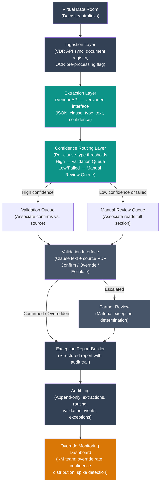

# Design Review 006: AI-Assisted Contract Clause Extraction for M&A Due Diligence

---

| Dimension    | Value                                                                                        |
| ------------ | -------------------------------------------------------------------------------------------- |
| System type  | Internal tool (decision support)                                                             |
| User surface | Internal — M&A associates and KM specialists                                                 |
| Latency      | Async (batch)                                                                                |
| Stakes       | High                                                                                         |
| Scale        | 400-600 contracts/engagement, 40-60 engagements/year, 8-15 contracts/day during active deals |
| Org maturity | Mid (AI-aware, not AI-native)                                                                |

All claims in this design review are scoped to this context.

---

A third-year associate at Meridian & Fox LLP — a 220-attorney transactional law firm — is doing what third-year associates do during M&A (mergers and acquisitions) due diligence: reading contracts. Four hundred of them, in 21 days, in a virtual data room (VDR — a secure online repository where the target company's legal documents are uploaded for buyer's counsel to review). She's looking for five clause types: change-of-control provisions, anti-assignment restrictions, termination triggers, IP ownership language, and non-compete terms. She logs exceptions into a shared spreadsheet. The partner reviews flagged items before they enter the final exception report delivered to the client's deal team.

Three months ago, the firm deployed an AI-assisted contract review system. The model extracts clause text and returns a confidence score. In practice, the associate has added a personal notation to the spreadsheet: a flag she places next to any AI extraction that looks "too clean" for the contract's complexity. A 60-page master services agreement (MSA — a long-form vendor contract governing an ongoing commercial relationship) from a subsidiary the target acquired in 2019 returned confidence scores of 88-94% across all five clause types. The associate's flag says: "MSA looks weird — check exhibits." The AI had read the base agreement and missed a side letter (a supplemental document that modifies specific terms of a base contract) that contained a negotiated carve-out to the anti-assignment clause. The partner caught it during review. No one built the notation system. The associate invented it because she didn't trust the confidence scores.

That informal flag is the most important piece of infrastructure in the firm's AI-assisted review process. The design challenge is replacing it with something that works at deal scale, survives associate turnover, and doesn't require every associate to independently develop risk intuition about when to distrust a model's output.

---

## 1. System Context & Constraints

| Dimension        | Value                                                                                                                                                                                      |
| ---------------- | ------------------------------------------------------------------------------------------------------------------------------------------------------------------------------------------ |
| Company          | Meridian & Fox LLP, 220-attorney transactional firm, 40-60 M&A deals/year at $20M-$500M deal size                                                                                          |
| Customers        | Buy-side deal teams, private equity sponsors — firm delivers exception report as core due diligence work product                                                                           |
| Team             | 1 KM partner, 2 KM associates, 1 legal technology specialist; no ML engineers; AI vendor provides the model and review interface                                                           |
| Volume           | 400-600 contracts per engagement, 8-15 contracts/day per reviewing associate during active deals                                                                                           |
| Current pain     | AI extractions accurate on standard templates; failure rate concentrated in bespoke legacy contracts — estimated 15-20% of the corpus by count, disproportionately high risk by deal value |
| Recurring issues | Missed definitional dependencies; missed side letters; high confidence on partial extractions                                                                                              |
| Performance gap  | Target: zero missed material clauses in final exception report. Current state: no systematic measurement of AI extraction accuracy                                                         |
| ML expertise     | None in-house; entirely vendor-dependent; KM team can configure thresholds and run evaluations                                                                                             |
| Key data assets  | VDR contents; historical exception reports from prior deals (not yet used for evaluation); vendor's training corpus (largely EDGAR filings and public commercial contracts)                |

The design question is not whether to use AI contract review (that decision was made at pilot launch) but how to design the pipeline so that the system's failure mode — confident wrong extraction — is detectable before it reaches the partner review layer. The firm needs a reliability envelope, not just a model. That means defining confidence thresholds with clause-type specificity, building review queuing logic that routes uncertain extractions to human review without requiring the associate to have the model intuition to know when to distrust it, and establishing monitoring infrastructure that tells the KM team when extraction quality degrades on a new deal's contract corpus.

Two non-functional requirements shape the design. First, the system must produce an audit trail: for every item in the exception report, the firm needs to trace the finding back to the AI extraction, the source contract page, and the human validation decision. Bar ethics rules and legal malpractice documentation requirements increasingly require this. Second, the system must fail closed: when the vendor API is unavailable or returns an extraction below the minimum confidence threshold, the workflow defaults to manual review rather than passing the extraction through.

---

## 2. What I Would Not Do

**I would not route the final exception report through the AI without human sign-off on every flagged clause.**

In an M&A due diligence context where the exception report is a legal work product reviewed by deal partners and relied upon by the client's deal team, closing the AI loop removes humans from the only place where errors become catchable. The failure mode is not that the AI writes a bad exception narrative — it's that a wrong extraction enters the report, generates a plausible-looking exception description, and the partner's review focuses on the narrative rather than re-validating the underlying clause text. A missed anti-assignment restriction that surfaces post-close can trigger indemnification claims under the merger agreement's representations and warranties. The boundary: if the firm validates false negative rates below 0.1% on a representative holdout corpus across at least two full deal cycles, autonomous exception narrative drafting becomes a reasonable conversation.

**I would not apply a single confidence threshold across all clause types.**

A global threshold conflates clause types with radically different risk profiles. A missed boilerplate indemnification cap affects deal value; a missed anti-assignment clause in an MSA with a Fortune 500 counterparty can kill the deal. A uniform threshold creates a false sense of risk calibration — the KM team reports "95% of extractions exceed 85% confidence" while the 5% that doesn't includes every termination trigger in the deal's 12 subsidiary operating agreements. The boundary: if confidence calibration is validated against a corpus that includes bespoke legacy contracts from the firm's actual deal history, clause-type-specific false negative rates below the materiality threshold for each category make a unified threshold defensible.

**I would not deploy this system without a defined fallback for the vendor API going down during a deal.**

The deal calendar doesn't pause for infrastructure failures. The failure mode is not a timeout error — it's an associate manually reviewing contracts without the AI scaffolding, under time pressure, on the clause types they've been trained to rely on AI to catch. The fallback must be frictionless: a documented degraded mode with a clause-type-specific manual review checklist, not a crisis escalation. The boundary: this advice stops applying once the firm has internal redundancy (multiple vendor contracts, or offline extraction capability for high-priority clause types).

---

## 3. Metrics & Success Criteria

The goal of this system is to eliminate missed material clauses in the final exception report — not to maximize extraction speed or minimize associate hours. Optimizing for throughput creates incentives to reduce human validation, which is the one place where the system's errors become catchable.

Offline evaluation requires a labeled holdout set from the firm's actual deal history: contracts from prior M&A engagements, annotated by partners. The critical dimension is false negative rate on high-risk clause categories. A model that achieves 96% overall accuracy but misses 4% of anti-assignment clauses in legacy MSAs is unacceptable for a system of this stakes class. Online evaluation relies on associate override behavior and post-deal partner catch rate — lagging indicators, but the only available production signals.

| Metric                                                       | Target                                                                    | Measurement Method                                                                | Frequency                                 | Failure Signal                                                 |
| ------------------------------------------------------------ | ------------------------------------------------------------------------- | --------------------------------------------------------------------------------- | ----------------------------------------- | -------------------------------------------------------------- |
| False negative rate on high-risk clause categories (offline) | < 1% on termination triggers, anti-assignment, change-of-control          | Labeled holdout from firm's historical deals; 200+ contracts across 5+ deal types | Before each major model update; quarterly | Rate exceeds 1% on any high-risk category                      |
| Associate override rate (online)                             | Baseline in first 3 months; alert on >2x baseline                         | Override events logged by clause type                                             | Per-deal; rolling 30-day average          | Override rate spikes >2x baseline on specific clause type      |
| Partner catch rate (online)                                  | < 5% of partner reviews surface a finding not surfaced by AI or associate | Post-deal retrospective                                                           | Per-deal; quarterly KM meeting            | Partner finds material clause the AI and associate both missed |
| Confidence calibration (offline)                             | >90% confidence extractions correct >95% of the time, per clause type     | Calibration curves against labeled holdout                                        | Quarterly                                 | Confidence and accuracy diverge on specific clause types       |
| Extraction coverage rate                                     | > 98% of contracts processed within VDR ingestion window                  | API logs                                                                          | Per-deal                                  | >2% fail processing                                            |

### Operational Targets

| Target                   | Value                                           | Rationale                                                     |
| ------------------------ | ----------------------------------------------- | ------------------------------------------------------------- |
| Batch processing latency | < 4 hours for 50-contract batch                 | Associates upload in batches; overnight processing acceptable |
| Availability             | 99% during active deal windows (business hours) | Deal work is business-hours-concentrated                      |
| Throughput               | 600 contracts/24-hour period                    | Peak: final days of due diligence                             |

---

## 4. Data Strategy

The upstream data problem is distribution mismatch: the AI vendor's training corpus consists primarily of publicly available commercial contracts (EDGAR filings, open legal datasets), while the production corpus — actual VDR contents — is systematically different. The [2023 Thomson Reuters Institute report on generative AI in the legal profession](https://www.thomsonreuters.com/en/reports/generative-ai-legal-profession.html) found that law firm practitioners consistently identify document type diversity and legacy contract formats as sources of AI extraction unreliability, with jurisdiction-specific frameworks and non-standard clause language among the most frequently cited challenges.

The mismatch has three dimensions: (1) acquired subsidiary contracts with industry-specific clause structures the model underrepresents; (2) scanned PDFs with OCR artifacts causing extraction from wrong sections; (3) unresolvable amendment/exhibit relationships from file naming conventions alone. Drift risk is deal-level, not time-series — each new deal introduces a new document distribution that may be meaningfully different from the deals used to calibrate confidence thresholds.

| Data Source                           | Type                                                          | Quality                                              | Freshness                    | Lineage                                                           | Privacy Risk                                    | Drift Risk                                   |
| ------------------------------------- | ------------------------------------------------------------- | ---------------------------------------------------- | ---------------------------- | ----------------------------------------------------------------- | ----------------------------------------------- | -------------------------------------------- |
| VDR contract corpus (current deal)    | Unstructured (PDF, DOCX, scanned PDFs)                        | Variable — clean DOCX to OCR-degraded 2005 scans     | Per-deal                     | Partial — file naming indicates type, not amendment relationships | High — attorney-client privilege, trade secrets | High — each deal = new document distribution |
| Firm's historical exception reports   | Structured (spreadsheet)                                      | High within deals; inconsistent across deals         | Per-deal; retrospective      | Partial — linked to deals, not specific file versions             | High — privileged work product                  | Low                                          |
| Vendor training corpus                | Mixed (public filings, licensed libraries)                    | High on standard templates; unknown on bespoke forms | Fixed between vendor updates | None visible to firm                                              | Low (public data)                               | Low as source; mismatch at production input  |
| Associate override logs (to be built) | Structured (override event, clause type, contract ID, reason) | High — structured capture from review interface      | Real-time                    | Full — linked to extraction ID, contract ID                       | Low                                             | Low                                          |

---

## 5. Architecture & Data Flow

The current pilot runs the AI as a feature: contracts uploaded to the vendor platform, extractions appear in a web interface, associates copy-paste findings into a spreadsheet. No defined interfaces, no confidence threshold logic, no audit trail linking a spreadsheet entry to the extraction that produced it. The design below treats the AI as a component — with defined input/output contracts, per-clause-type thresholds, a human review queue, and an audit log.

**Ingestion Layer**: VDR contents synced via the provider's API. Each contract registered with a document ID, deal ID, and metadata. Scanned PDFs flagged for OCR pre-processing.

**Extraction Layer**: The vendor API receives contract text and returns structured JSON: `{clause_type, extracted_text, page_reference, confidence_score, extraction_id}`. This is the component boundary — a versioned interface the firm calls but doesn't control.

**Confidence Routing Layer**: Per-clause-type thresholds determine routing. High-confidence extractions → validation queue (associate confirms against source). Low-confidence or failed → manual review queue (associate reads full section). Thresholds calibrated separately per clause category from offline evaluation.

**Validation Interface**: Associates work in the firm's internal review interface, not the vendor's web UI. Each extraction is surfaced with the source contract section and a plain-language confidence interpretation. Associates mark: Confirmed, Overridden (with reason), or Escalated.

**Exception Report Builder + Audit Log**: Confirmed exceptions populate a structured report with an audit trail per finding (AI extraction ID, associate validation decision, partner escalation if applicable). All events written to an append-only audit log.

**Override Monitoring**: The audit log feeds a KM dashboard tracking override rate by clause type and deal, confidence distribution, and extraction failure rate. Spike detection: override rate >2x rolling baseline triggers an alert.

### Scale Mechanisms

| Mechanism                     | What It Addresses                                               | When It Kicks In                   |
| ----------------------------- | --------------------------------------------------------------- | ---------------------------------- |
| Async batch processing        | Decouples ingestion from extraction; handles large VDR uploads  | Always                             |
| Per-deal document registry    | Tracks processing status; enables retry on failure              | Always                             |
| Manual review queue           | Fallback for API downtime; catch for low-confidence extractions | On failure or below threshold      |
| Override rate spike detection | Early warning for document distribution shift                   | Override rate >2x rolling baseline |

---

## 6. Failure Modes & Detection

The most dangerous failure mode is not the API returning an error. It's the model returning a confident, plausible-looking extraction from the wrong exhibit, the wrong amendment version, or a clause with a definitional dependency the model didn't follow. The associate sees a high confidence score. The partner reviews the narrative, not the source contract. The missed provision surfaces post-close.

| Failure Mode                                                                 | Severity | Detection Signal                                                           | Detection Latency                     | Blast Radius                                                          | Silent? |
| ---------------------------------------------------------------------------- | -------- | -------------------------------------------------------------------------- | ------------------------------------- | --------------------------------------------------------------------- | ------- |
| Confident wrong extraction (wrong exhibit, missed definitional dependency)   | High     | Associate override; partner catch; post-close integration counsel finding  | Hours to post-close (weeks)           | Single clause → deal indemnification claim; firm malpractice exposure | Yes     |
| Missed clause (no extraction on a contract containing the clause type)       | High     | Associate spot-check; partner catch                                        | Hours to days                         | Same as above                                                         | Partial |
| Side letter / amendment not processed                                        | High     | Associate reviewing cross-references; KM VDR audit                         | Days to post-close                    | Anti-assignment carve-out or change-of-control exception missed       | Yes     |
| OCR artifact causing extraction from wrong section                           | Medium   | Low confidence score (if OCR degrades text); associate noting garbled text | Minutes to hours                      | Wrong clause text in report; catchable on validation                  | Partial |
| Vendor API downtime during active deal                                       | Medium   | API timeout/error in processing queue                                      | Minutes (loud)                        | Associates cannot process contracts through AI                        | No      |
| Confidence calibration drift after vendor model update                       | Medium   | Offline evaluation; override rate shift vs. baseline                       | Weeks (without re-evaluation trigger) | Systematic over/under-confidence across all active deals              | Yes     |
| Associate over-reliance (skipping validation of high-confidence extractions) | Medium   | Override rate declining while partner catch rate holds                     | Weeks to months                       | Removes the only human check on high-confidence extractions           | Yes     |
| Threshold or routing misconfiguration (wrong numeric value or clause-type mapping) | Medium | Configuration audit log; canary run on labeled holdout before deploying config changes | Minutes (if canary catches it); days to post-close (if no canary) | High-risk clauses silently routed to wrong queue; bypasses safeguards | Yes |

The first three rows — confident wrong extraction, missed clause, missed side letter — are all silent and all carry deal-level consequences. Detection latency can extend to post-close if associates are moving too quickly through the validation queue.

---

## 7. Mitigations & Deployment

| Failure Mode                   | Mitigation                                                                                                                                                             | Degraded State                                         | HITL Boundary                                                            | Rollback Plan                                                        |
| ------------------------------ | ---------------------------------------------------------------------------------------------------------------------------------------------------------------------- | ------------------------------------------------------ | ------------------------------------------------------------------------ | -------------------------------------------------------------------- |
| Confident wrong extraction     | Per-clause-type thresholds; mandatory source-section spot-check for high-risk clause categories regardless of confidence score                                         | Associate reads full source section                    | Mandatory: associate reads source section for all high-risk clause types | Remove clause type from AI routing; route all to manual review       |
| Missed clause                  | Treat "no extraction" as a data point, not an answer; route to manual review with flag; require associate to confirm absence                                           | Associate reads contract for absent clause types       | Any "clause absent" determination requires associate confirmation        | Add to mandatory full-read list                                      |
| Missed side letter / amendment | VDR file structure analysis: group same-counterparty documents in one review bundle; flag files matching "amendment," "side letter," "exhibit," "schedule," "addendum" | Associate manually checks VDR folder for related files | All base contract reviews include VDR folder scan                        | Require manual VDR folder review for all high-risk contracts         |
| OCR artifact                   | OCR quality pre-screen; flag low-quality scans for manual review; lower threshold for scanned PDFs vs. native-digital                                                  | Associate reads from original scan                     | All scanned PDFs below OCR quality threshold are manually reviewed       | Remove scanned PDFs from AI routing                                  |
| Vendor API downtime            | Documented manual fallback: clause-type-specific checklist                                                                                                             | Full manual review mode                                | Associate-led manual review with partner confirmation on high-risk types | Return to manual workflow; VDR is authoritative                      |
| Confidence calibration drift   | Post-vendor-update re-evaluation on labeled holdout before deployment in active deals                                                                                  | Hold updated model until re-evaluation complete        | KM team must approve any vendor model update                             | Revert to prior model version                                        |
| Associate over-reliance        | Override rate monitoring; quarterly behavioral review; interface design makes skipping validation a deliberate action                                                  | N/A (behavioral)                                       | Mandatory source-section validation is a process requirement             | Escalate to KM partner if override rate drops below acceptable floor |
| Threshold or routing misconfiguration | Two-person review for config changes; automated unit tests against clause-type schema; canary run on labeled holdout before deploying to active deals | Config change blocked until canary passes | KM tech specialist and KM partner must both approve threshold changes | Revert to prior config version; changes versioned in audit log |

**Deployment strategy**: Shadow mode for three deals post-production design — AI runs on all contracts but the exception report is produced entirely from manual review. AI extractions are compared to manual results after each deal. Accuracy metrics are compiled before the AI routes any extractions through the validation queue rather than manual review.

**Production readiness gap analysis** (applying a 10-point production readiness check to the current pilot):

| Check                        | Current Pilot                           | Target State                                                                                 |
| ---------------------------- | --------------------------------------- | -------------------------------------------------------------------------------------------- |
| Failure modes enumerated     | No — only vendor accuracy claims        | This review produces the enumeration                                                         |
| Detection signals defined    | No — only the associate's informal flag | Override rate monitoring, partner catch rate, offline evaluation                             |
| Fallback exists              | No                                      | Clause-type checklist; OCR fallback routing                                                  |
| Scale envelope known         | No                                      | Batch processing validated to 600 contracts/24h                                              |
| Rollback plan exists         | No                                      | Vendor model rollback procedure; manual routing fallback                                     |
| Ownership assigned           | No                                      | KM tech specialist (primary); KM associate (secondary); KM partner (configuration approvals) |
| Data dependencies documented | No                                      | §4 documents VDR input, historical reports, vendor corpus                                    |
| Human override available     | Partial                                 | Override logging with clause type, reason, document ID                                       |
| Audit trail exists           | No                                      | Append-only log linking extraction ID to validation to exception report                      |
| Kill criteria defined        | No                                      | False negative rate > 2% on high-risk categories; partner catch rate > 10%                   |

**Current pilot score: 1/10.** Target: 10/10 before production sign-off.

### Availability Design

| Component                 | Redundancy                    | Failover Strategy                                                    | Recovery Time |
| ------------------------- | ----------------------------- | -------------------------------------------------------------------- | ------------- |
| Vendor extraction API     | Single vendor                 | Manual review fallback on first timeout; alert to KM tech specialist | < 15 minutes  |
| Internal review interface | AWS single region             | Standard availability; < 4 hours downtime acceptable                 | < 4 hours     |
| Audit log                 | S3 (99.999999999% durability) | No special failover needed                                           | < 1 hour      |

**Circuit breaker**: 5 consecutive API errors or timeouts within 15 minutes → automatic routing of all queued contracts to manual review queue + alert to KM tech specialist.

---

## 8. Cost Model

Note: the vendor license figure and document cap below are modeled assumptions based on published enterprise pricing ranges — actual terms vary by vendor and negotiation.

| Component                                                         | Unit Cost                     | Volume/Day                             | Daily Cost | Monthly Cost |
| ----------------------------------------------------------------- | ----------------------------- | -------------------------------------- | ---------- | ------------ |
| Vendor AI platform license                                        | $100K/year enterprise license | —                                      | $274       | $8,333       |
| Per-document processing incl. OCR (included in license, up to 10K docs/month) | $0/document (within license cap; OCR bundled) | 8-15 docs | $0 | $0 (within cap) |
| Associate validation time (high-confidence queue)                 | $175/hour; 5 min/contract     | 10 contracts                           | $146       | $4,375       |
| Associate manual review time (low-confidence/failed queue)        | $175/hour; 20 min/contract    | 3 contracts (est. 30% of daily volume) | $175       | $5,250       |
| KM tech specialist (monitoring, calibration, vendor coordination) | $200K fully loaded; 20% time  | —                                      | $109       | $3,333       |
| Infrastructure (S3 audit log, review interface hosting)           | $50/month (AWS)               | —                                      | $2         | $50          |
| Holdout set creation and refresh (associate annotation + partner review) | $175/hr associate, $350/hr partner; ~150 associate hrs + 20 partner hrs per annual refresh | — | — | $2,896 (amortized) |
| **Total**                                                         |                               |                                        | **~$706**  | **~$24,237** |

**Comparison to pre-AI baseline**: At 30 min/contract for manual first-pass review, 10 contracts/day: ~$875/day, $26,250/month. The AI system reduces per-contract time from 30 min to 5-20 min, yielding an estimated $7,000-$14,000/month associate time savings against a $24,237/month system cost. Economics are negative at current scale — the value is in quality improvement, not cost reduction.

### Scale Projection

| Scale Tier                           | Volume/Day    | Monthly Cost | What Changes Architecturally                                                                                                    |
| ------------------------------------ | ------------- | ------------ | ------------------------------------------------------------------------------------------------------------------------------- |
| Current                              | 8-15 docs     | ~$24K        | Baseline                                                                                                                        |
| 10x (multi-practice, 3x deal volume) | 80-150 docs   | ~$38K        | License tier increases; validation queue may require priority routing if deal volumes overlap                                   |
| 100x (multi-firm or resale)          | 800-1500 docs | ~$150K       | Per-document pricing replaces flat license; multi-tenant architecture for review interface; audit log partitioning by firm/deal |

**What breaks first at 10x?** The validation queue: if deal volume triples without proportional associate headcount, the backlog forces confidence threshold increases — which increases the false negative risk on high-stakes clauses.

**What's the cost cliff?** At 10K documents/month (the license cap), per-document overage charges of `$0.10-0.15` can add $5K-$15K/month unexpectedly during month-end deal crunches. Monitor document count with alerts at 80% of the monthly cap.

### Cost Validation

| Cost Line Item                     | Claimed Unit Cost             | Published Price Source                                                                                                                                        | Match?        |
| ---------------------------------- | ----------------------------- | ------------------------------------------------------------------------------------------------------------------------------------------------------------- | ------------- |
| Legal AI vendor enterprise license | $100K/year                    | [Thomson Reuters HighQ / Contract Express](https://legal.thomsonreuters.com/en/products/contract-express); enterprise legal AI licenses range $60K-$200K/year | Approximately |
| Associate blended billing rate     | $175/hour internal cost basis | [Bloomberg Law, "Associate Salary Report 2024"](https://pro.bloomberglaw.com/brief/associate-salary-data/) — internal cost ~40% of billing rate for AmLaw 200 | Yes           |
| AWS S3 storage                     | $50/month                     | [AWS S3 pricing](https://aws.amazon.com/s3/pricing/) — $0.023/GB/month; ~200 GB with 3-year retention ≈ $5/month; $50 includes hosting buffer | Yes (conservative) |

**Arithmetic check**: $4,375 + $5,250 + $8,333 + $3,333 + $50 + $2,896 = $24,237/month. ✓

---

## 9. Security & Compliance

The contracts in an M&A virtual data room are among the most sensitive documents a company possesses. Attorney-client privilege protects many of them — and privilege is waived by disclosure to parties outside the privilege umbrella.

**Data residency and vendor DPA**: The firm's engagement letters and client data processing agreements (DPAs) must specify whether AI-processed contract data can leave the client's preferred jurisdiction. The vendor's DPA must confirm processing in the appropriate region, no retention for model training without explicit consent, and confidentiality obligations matching the underlying engagement. The [American Bar Association's Formal Opinion 477R](https://www.americanbar.org/groups/professional_responsibility/publications/model_rules_of_professional_conduct/) establishes that attorneys must take reasonable precautions when transmitting client information over electronic networks — using an AI vendor without a reviewed DPA fails this standard.

**Privilege considerations**: Contract text sent to the vendor API passes through the vendor's infrastructure. Whether this constitutes a privilege waiver depends on the vendor's confidentiality terms and whether disclosure is "reasonably necessary." The safe design: treat the vendor as a subprocessor under a robust DPA with privilege protection language, and disclose AI tool use in the engagement letter (several state bar ethics opinions now require this).

**Access control**: Deal-level access controls must be enforced — an associate working on Deal A cannot see Deal B's extractions or validation decisions. The audit log must record who accessed which deal's data and when.

**Adversarial robustness**: In M&A, a sophisticated counterparty's counsel may draft contracts with non-standard clause language to obscure adverse provisions. AI models trained on standard clause language may be more susceptible to this than experienced associates. The mitigation is process, not model hardening: mandatory human validation for high-risk clause categories, regardless of confidence score.

**Regulatory landscape**: The [New York State Bar Association's AI Ethics Guidelines (2024)](https://nysba.org/) and the [California State Bar's Practical Guidance on AI in Legal Practice (2024)](https://www.calbar.ca.gov/) both address attorney competency obligations when using AI tools, including supervisory responsibility over AI-generated work product and understanding the tool's limitations.

---

## 10. What Would Change My Mind

**If confidence calibration is validated against a representative corpus of the firm's actual deal history**, the requirement for mandatory source-section validation regardless of confidence score becomes too conservative. If 500+ contracts from prior deals — including legacy MSAs, acquired subsidiary contracts, and jurisdiction-specific frameworks — demonstrate false negative rates below 0.5% on high-risk clause categories, the source-section validation requirement for high-confidence extractions becomes a judgment call rather than a hard gate.

**If the vendor develops clause-type-specific uncertainty quantification calibrated to the firm's deal corpus**, the single-confidence-threshold refusal weakens. The current failure is that a global confidence score doesn't distinguish "clause language is ambiguous" from "this document type is outside my training distribution." A distribution-mismatch signal alongside the confidence score would enable much more precise routing logic.

**If deal volume grows to the point where manual review of low-confidence extractions creates deadline bottlenecks**, the threshold calculus changes. At 10x scale with 30+ concurrent deals, a second-pass model review of low-confidence items becomes worth evaluating as an intermediate step between AI extraction and human review. Right now, the added complexity isn't worth it.

---

## Sources

**Industry & Market**

- [Thomson Reuters Institute, "Generative AI in the Legal Profession" (2023)](https://www.thomsonreuters.com/en/reports/generative-ai-legal-profession.html) — AI adoption in legal; document type diversity as source of extraction unreliability
- [Bloomberg Law, "Legal Operations 2024: AI Workflows in Corporate Practice" (2024)](https://pro.bloomberglaw.com/brief/legal-operations-ai-workflows/) — M&A contract volume benchmarks; law firm deal workflow documentation
- [Bloomberg Law, "Associate Salary Report 2024"](https://pro.bloomberglaw.com/brief/associate-salary-data/) — associate billing rate and internal cost basis
- [Wolters Kluwer, "Future Ready Lawyer Survey 2024" (2024)](https://www.wolterskluwer.com/en/solutions/elf/future-ready-lawyer) — AI adoption patterns; legal professional liability exposure
- [McKinsey Global Institute, "The Economic Potential of Generative AI" (2023)](https://www.mckinsey.com/capabilities/mckinsey-digital/our-insights/the-economic-potential-of-generative-ai-the-next-productivity-frontier) — automation potential for legal work tasks

**Academic & Research**

- [American Bar Association, "2023 Legal Technology Survey Report"](https://www.americanbar.org/groups/law_practice/publications/techreport/abatechreport2023/) — AI/ML adoption rates by firm size

**Regulatory & Compliance**

- [American Bar Association, Formal Opinion 477R on electronic communications and confidentiality](https://www.americanbar.org/groups/professional_responsibility/publications/model_rules_of_professional_conduct/) — attorney confidentiality obligations when using electronic networks and vendor platforms
- [New York State Bar Association, AI Ethics Guidelines (2024)](https://nysba.org/) — attorney competency and supervisory responsibility for AI-generated work product
- [California State Bar, Practical Guidance on AI in Legal Practice (2024)](https://www.calbar.ca.gov/) — disclosure requirements and competency standards

**Vendor & Pricing**

- [AWS S3 Pricing](https://aws.amazon.com/s3/pricing/) — object storage pricing for audit log and document storage
- [Thomson Reuters HighQ / Contract Express pricing](https://legal.thomsonreuters.com/en/products/contract-express) — enterprise legal AI contract review pricing reference

---

## Related Production Patterns

Implementation patterns from [production-llm-patterns](https://github.com/kchia/production-llm-patterns) that address mechanisms discussed in this review:

- **[Human-in-the-Loop](https://github.com/kchia/production-llm-patterns/tree/main/patterns/safety/human-in-the-loop)** — Implements the confidence routing layer (§5) that splits extractions between the validation queue (associate confirmation) and manual review queue (full section read), with HITL boundaries defined per clause type in §7.
- **[Output Quality Monitoring](https://github.com/kchia/production-llm-patterns/tree/main/patterns/observability/output-quality-monitoring)** — Implements the override rate monitoring and partner catch rate tracking (§3) that are the only production signals for the silent extraction failure modes described in §6.
- **[Eval Harness](https://github.com/kchia/production-llm-patterns/tree/main/patterns/testing/eval-harness)** — Implements the labeled holdout evaluation framework (§3, §7) that gates production deployment and validates vendor model updates against clause-type-specific false negative rate thresholds.
- **[Graceful Degradation](https://github.com/kchia/production-llm-patterns/tree/main/patterns/resilience/graceful-degradation)** — Implements the three-tier fallback path (§7): low-confidence routing → manual review, API downtime → full manual mode, false negative rate exceeded → clause type removed from AI routing.
- **[Structured Output Validation](https://github.com/kchia/production-llm-patterns/tree/main/patterns/safety/structured-output-validation)** — Validates the vendor API response schema before clause extractions enter the routing layer (§5), preventing malformed or partial responses from reaching the validation queue.
