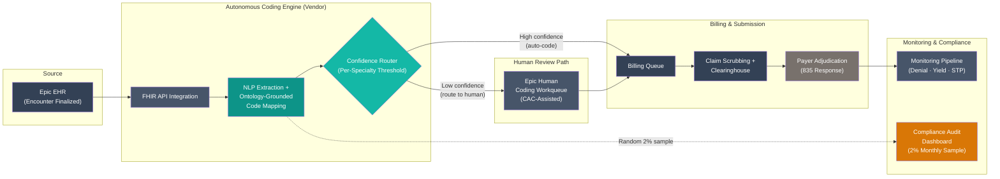

# Design Review 007: Autonomous Medical Coding with Ontology-Grounded ICD-10/CPT Assignment

---

| Dimension    | Value                                                 |
| ------------ | ----------------------------------------------------- |
| System type  | Internal platform                                     |
| User surface | Internal — coders, billing staff, compliance auditors |
| Latency      | Async                                                 |
| Stakes       | High                                                  |
| Scale        | 650,000 professional fee encounters/year              |
| Org maturity | Mid — mature on EHR, no internal ML engineering       |

All claims in this design review are scoped to this context.

---

Rachel Okonkwo runs coding operations for six hospitals. Her day starts with the workqueue — how many encounters are aging past the 72-hour coding window, how many are stuck waiting for a specialist coder to become available, and whether the overflow routing to her BPO (Business Process Outsourcing — an external vendor that handles coding work her team can't absorb) is going to generate another billing cycle delay. The queue has been growing for a year. Twelve of her 67 coder positions have been open for more than three months. Filling them is harder each quarter: a 12% nationwide coding talent gap ([AAPC, 2024](https://www.aapc.com/blog/92000-survey-says-aapc-credentials-insulate-members-from-inflation/)) means she is competing for credentialed staff against two larger academic medical centers within 30 miles and a growing pool of remote-first vendors actively recruiting her trained team.

The overflow goes to the BPO vendor at $9 per encounter. The vendor doesn't have direct access to Epic (the hospital's electronic health record system), so the workflow is a file export, a 24-hour turnaround, and a reimport — adding a day to billing cycle time and introducing data quality variation that is hard to track. Her clean claim rate (the percentage of submitted claims paid on first pass, without denial or correction) sits at 91.4%. The [Healthcare Financial Management Association](https://www.hfma.org/revenue-cycle/survey-summary-2024-revenue-cycle-management/) benchmarks 95% as the industry target. Denied amounts increased 4.8% for outpatient claims in 2024 versus the prior year. The denial management team is backlogged.

The CFO has given Rachel 18 months to demonstrate a technology-based alternative, or the system will hand the entire revenue cycle function to a large outsourcer. An $800K pilot budget has been approved. After evaluating the commercial autonomous coding market, Rachel's shortlist is down to two vendors — Nym Health and Fathom Health. Both hold Epic Toolbox designation (a certified vendor marketplace for Epic-integrated software) in the Fully Autonomous Coding category. Both report 90%+ straight-through processing (STP) rates — meaning 90% of encounters are coded and submitted without any human review — for routine encounter types ([Healthcare IT Today, 2024](https://www.healthcareittoday.com/2024/11/08/autonomous-medical-coding-engine-nym-announces-47-million-growth-investment-led-by-psg/)).

The question her clinical informatics director keeps returning to is not whether AI can code — it demonstrably can — but what happens when it codes validly but suboptimally: assigns an ICD-10-CM (International Classification of Diseases, 10th Revision, Clinical Modification — the standard code set used to describe diagnoses on insurance claims) code that is technically correct but not the highest-supported specificity. No denial. No error flag. Just revenue quietly left on the table at scale.

---

## 1. System Context & Constraints

| Dimension        | Value                                                                                                                                                                                          |
| ---------------- | ---------------------------------------------------------------------------------------------------------------------------------------------------------------------------------------------- |
| Company          | Six-hospital regional health system, ~$1.2B net patient revenue, mid-Atlantic; employed physician groups across primary care, hospital medicine, orthopedics, gastroenterology, and cardiology |
| Customers        | Internal — coders, billing staff, compliance auditors; downstream payers (Medicare 40%, Medicaid 30%, commercial 30%)                                                                          |
| Team             | VP of Revenue Cycle (owner), 55 FTE (full-time equivalent) professional fee coders (12 vacancies), 2 clinical informatics staff, no ML engineering                                                                    |
| Volume           | 650,000 professional fee encounters/year (~54,000/month); ~30,000/month currently routed to BPO overflow                                                                                       |
| Current pain     | Clean claim rate 91.4% vs. 95%+ benchmark; $3.2M/year unbudgeted BPO overflow spend; 12 open positions >90 days                                                                                |
| Recurring issues | Aging workqueue (encounters >72 hours uncoded); BPO quality variation; specialty coding gaps in high-complexity encounters                                                                     |
| Performance gap  | 3.6 points below clean claim rate benchmark; billing cycle time increasing                                                                                                                     |
| ML expertise     | None in-house; vendor-dependent for model deployment, maintenance, annual code set updates                                                                                                     |
| Key data assets  | Epic EHR (5+ years, fully coded encounter history); payer adjudication data (835 files — electronic payment explanations from insurers) available but not yet in a usable pipeline                                                             |

The design question is whether the unit economics of autonomous professional fee coding close at this health system's scale, specialty mix, and compliance requirements. The functional requirement is automating CPT (Current Procedural Terminology — the standard code set describing what procedures were performed) and ICD-10-CM code assignment for high-confidence encounters while routing ambiguous cases to human coders.

The non-functional requirements are harder: a clean claim rate that improves rather than degrades, a revenue yield per encounter that matches what human coders would have achieved, and a compliance audit trail sufficient to satisfy OIG (Office of Inspector General — the federal watchdog for healthcare fraud and billing abuse) guidance. The HHS OIG has explicitly recommended that health systems audit AI-coded Medicare and Medicaid claims before submission. Separately, CMS (Centers for Medicare & Medicaid Services — the federal agency that runs Medicare and Medicaid) is expected to issue formal guidance on autonomous coding in the FY2026 IPPS (Inpatient Prospective Payment System — the annual regulation that sets hospital payment rates) proposed rule ([OIG HHS.gov, 2025](https://oig.hhs.gov/compliance/)).

---

## 2. What I Would Not Do

**If I were responsible for this system, I would not deploy autonomous coding on Medicare inpatient DRG assignment without a compliance-grade audit sampling protocol in place before the first claim is submitted.**

In a health system with 40% Medicare volume, autonomous DRG (Diagnosis Related Group — the payment categories Medicare uses to reimburse hospitals per inpatient admission) assignment on inpatient claims operates under explicit OIG scrutiny. The failure mode here is not a coding error that generates a denial — it is a systematic undercoding pattern that assigns valid but lower-weighted DRGs consistently across a class of encounters. No payer pushback is generated. The pattern becomes visible only during a RAC (Recovery Audit Contractor — a firm hired by Medicare to retrospectively review hospital billing for patterns of over- or underpayment) audit, at which point months of claims may have been submitted under a pattern that triggers False Claims Act review. The False Claims Act is the federal law that penalizes submitting incorrect claims to government healthcare programs — and it does not require intent. Systematic AI output that the health system failed to validate is not a defense.

The boundary: if the vendor provides an OIG-aligned audit sampling framework with documented accuracy commitments at the DRG level, and if internal legal counsel has signed off on the compliance protocol, the risk profile changes. But that is not the default deployment configuration, and it should not be assumed.

**I would not use straight-through processing rate as the primary success metric for this deployment.**

STP rate measures throughput — how many encounters move through without human touch. It does not measure whether the AI coded specifically, correctly, or at the highest supported reimbursement level. A system can achieve 93% STP while consistently assigning lower-specificity ICD-10-CM codes on 8% of auto-processed encounters — because undercoded claims do not generate denials or error flags. They just pay at a lower rate. The incentive structure for autonomous coding vendors is to maximize STP, because that is the metric health systems request.

The boundary: STP rate becomes a valid signal when paired with monthly code specificity audits (comparing AI output to what a senior coder would have assigned on a random sample), denial rate delta tracked by cohort (AI-coded vs. human-coded), and revenue yield per encounter by specialty. As a standalone metric, it measures the wrong thing.

**I would not deploy autonomously across all five specialties simultaneously in the first 12 months.**

Autonomous coding STP rates vary materially by specialty. Primary care and hospital medicine routinely achieve 90%+ STP in vendor benchmarks. Oncology, complex surgery, and behavioral health are meaningfully lower. Deploying across all specialties simultaneously means discovering specialty-specific accuracy gaps through denial rate increases in specific code families — by which point weeks of claims have already been submitted at the wrong threshold. The boundary: if the vendor provides specialty-specific STP rate data from comparable health systems (not vendor-selected showcase accounts), and if the deployment model includes per-specialty confidence thresholds, a more aggressive timeline becomes defensible.

---

## 3. Metrics & Success Criteria

Success for autonomous professional fee coding has two failure modes that standard metrics don't separate: efficiency failures (the system doesn't reduce labor cost) and revenue integrity failures (the system codes validly but suboptimally — picking a code that's technically correct but pays less than the documentation supports). Denial rate monitoring catches neither. A stable denial rate after deployment is not evidence the system is performing well — it is evidence the AI is producing claims that payers accept. Whether those claims represent the highest-supported reimbursement requires a different measurement method: a standing operational comparison of AI-assigned codes against what a senior coder would have assigned, on a 2% monthly random sample.

| Metric                                            | Target                                                        | Measurement Method                                                  | Frequency | Failure Signal                                             |
| ------------------------------------------------- | ------------------------------------------------------------- | ------------------------------------------------------------------- | --------- | ---------------------------------------------------------- |
| STP rate by specialty                             | ≥90% primary care; ≥85% hospital medicine; ≥75% cardiology/GI | Vendor dashboard + Epic billing workflow                            | Weekly    | Any specialty dropping 5+ points from calibrated baseline  |
| First-pass correction rate                        | ≤12% of auto-coded encounters corrected by human reviewer     | Compare auto-coded to corrected in Epic workqueue                   | Weekly    | >12% sustained for 2 weeks                                 |
| Clean claim rate (AI cohort)                      | ≥94% (from 91.4% baseline)                                    | Clearinghouse + payer adjudication, segmented by coding path        | Monthly   | AI-coded cohort denial rate higher than human-coded cohort |
| Code specificity audit score                      | ≥95% match to senior-coder ground truth                       | 2% random sample reviewed by senior coder                           | Monthly   | >5% divergence triggers specialty review                   |
| Revenue yield per encounter (AI vs. human cohort) | Within 1.5% of human-coded cohort by encounter type           | Average RVU (relative value unit — Medicare's standard measure of the work, expense, and risk of a medical service; higher RVU = higher reimbursement) per encounter across coding paths | Monthly   | Yield gap >2% is a go/no-go gate for full deployment       |
| Fully loaded cost per encounter                   | ≤$6.50 (from ~$12.18 blended current)                         | Total coding cost ÷ total encounters                                | Quarterly | Rising above $7.50 triggers cost model review              |

### Operational Targets

| Target              | Value                              | Rationale                                                                      |
| ------------------- | ---------------------------------- | ------------------------------------------------------------------------------ |
| Coding cycle time   | <48 hours encounter-to-coded claim | Encounters aging past 72 hours increase days in AR (accounts receivable — how long it takes to get paid)                             |
| System availability | 99.5% during business hours        | Epic workqueue serves as fallback; 4-hour recovery window acceptable overnight |
| Daily throughput    | 3,000 encounters/day peak          | ~54K/month ÷ 18 working days; Monday volume typically 30% higher               |

---

## 4. Data Strategy

The training data provenance question is the one most health systems skip in autonomous coding pilots. Autonomous coding vendors train on large cross-customer datasets, which creates a network-effect quality advantage but also a generalization question: how well does the model perform on this system's specific documentation patterns, note templates, and specialty mix? A model trained predominantly on academic medical center data may produce systematically lower-quality outputs on community hospital documentation.

Two structural data risks warrant attention before the pilot begins. First, ICD-10-CM and CPT code sets update annually — ICD-10-CM sees 200–400 new codes per year, and CPT sees approximately 600 changes annually. An autonomous coding engine running stale code sets produces claims with invalid codes that trigger systematic clearinghouse rejections. The vendor's code set refresh cadence must be a contractual commitment. Second, historical coding data encodes the patterns of the coders who produced it — including undercoding shortcuts and documentation-driven biases. If the vendor fine-tunes on Hartwell's historical data, it learns those patterns at scale.

| Data Source                                      | Type                                   | Quality                               | Freshness                          | Lineage                    | Privacy Risk                  | Drift Risk                                         |
| ------------------------------------------------ | -------------------------------------- | ------------------------------------- | ---------------------------------- | -------------------------- | ----------------------------- | -------------------------------------------------- |
| Epic encounter notes (physician-attested)        | Unstructured clinical text             | High                                  | Real-time post-attestation         | Traceable per encounter ID | High — contains patient data (PHI); BAA required      | Medium — EHR template changes alter note structure |
| Historical coded encounters (5-year Epic)        | Structured code pairs                  | Medium — encodes prior coder behavior | Static at deployment               | Traceable by encounter ID  | High — PHI if linked to notes | High at annual code-set update events              |
| ICD-10-CM / CPT reference ontology (the official code sets published by CMS and the AMA (American Medical Association) that define every valid diagnosis and procedure code)     | Structured code set                    | High — authoritative                  | Annual (ICD-10: Oct 1; CPT: Jan 1) | Authoritative              | None                          | High — annual updates require model refresh        |
| Payer adjudication results (835 EDI files — the electronic responses insurers send back explaining how each claim was paid, denied, or adjusted)       | Structured claim response              | High — payer-authoritative            | 15–30 days post-submission         | Traceable by claim ID      | Medium                        | Medium — payer policy changes without notice       |
| Monthly audit sample (senior-coder ground truth) | Structured code pairs, expert-assigned | High                                  | Monthly                            | Traceable per encounter    | High — PHI in reviewed notes  | Low                                                |

---

## 5. Architecture & Data Flow

The autonomous coding pipeline is an async processing layer between encounter finalization and claim submission. It does not block billing operations — the fallback path (Epic's native human coding workqueue) is always active and independent of vendor uptime.

**Core components:**

1. **Epic EHR** — Source of finalized encounter notes. Connects to the coding engine via FHIR (Fast Healthcare Interoperability Resources — a standard data exchange format for healthcare systems), which means data flows directly between systems instead of requiring the manual file exports that Rachel's BPO vendor currently uses.
2. **Autonomous Coding Engine** — Reads clinical notes, extracts diagnoses and procedures using NLP (natural language processing), maps them to ICD-10-CM/CPT codes using medical ontologies (structured code vocabularies that define valid codes and their relationships), and assigns a confidence score to each code. The vendor hosts the AI infrastructure.
3. **Confidence Router** — The decision gate. Routes encounters based on per-specialty confidence thresholds. High-confidence encounters: code set attached and routed directly to billing. Low-confidence encounters: AI suggestions pre-populated in the Epic workqueue for human review — so coders see the AI's best guess as a starting point rather than starting from scratch.
4. **Epic Human Coding Workqueue** — Receives low-confidence encounters. Operates independently of vendor uptime. This is the always-on fallback — if the vendor goes down, all encounters simply route here, which is how the system works today.
5. **Billing Queue → Claim Scrubbing → Clearinghouse** — The existing claim submission workflow. A clearinghouse is a third-party service that validates claim formatting and routes claims to the correct insurer. This pipeline applies identically to AI-coded and human-coded encounters.
6. **Monitoring Pipeline** — Ingests payer adjudication data (835 files), workqueue correction data, and vendor routing logs to compute denial rate by cohort, correction rate by specialty, and revenue yield per encounter. This is how the system detects silent undercoding. Requires custom data engineering.
7. **Compliance Audit Dashboard** — 2% random monthly sample of auto-coded encounters reviewed by a senior coder to check whether the AI assigned the most specific codes the documentation supports. Feeds the code specificity score.

### Scale Mechanisms

| Mechanism                            | What It Addresses                                                        | When It Kicks In                                   |
| ------------------------------------ | ------------------------------------------------------------------------ | -------------------------------------------------- |
| Async queue processing               | Decouples encounter finalization from coding; smooths Monday volume peak | Always — batch processing is the standard model    |
| Per-specialty confidence thresholds  | Prevents specialty-specific accuracy problems from affecting full volume | Required at deployment for multi-specialty rollout |
| Epic workqueue as permanent fallback | Graceful degradation to current workflow when vendor API is unavailable  | Always active; independent of vendor               |

---

## 6. Failure Modes & Detection

The failure taxonomy for autonomous medical coding has one defining characteristic: the most financially consequential failures are silent. Denials are noisy and visible within 30–60 days. Systematic undercoding generates nothing — a claim coded at evaluation and management (E&M) level 3 instead of level 4 (E&M levels are the complexity tiers that determine how much a physician visit is reimbursed — level 4 pays roughly $30–60 more than level 3 for the same visit) pays at the lower rate, closes, and is never revisited. At 585,000 auto-coded encounters per year with a 3% undercoding rate, that's approximately 17,500 encounters per year each generating $20–$60 less than documentation supports — a revenue leak of $350K–$1M annually with no alarm attached.

| Failure Mode                                                       | Severity | Detection Signal                                                                            | Detection Latency     | Blast Radius                                                                               | Silent? |
| ------------------------------------------------------------------ | -------- | ------------------------------------------------------------------------------------------- | --------------------- | ------------------------------------------------------------------------------------------ | ------- |
| Suboptimal ICD-10-CM/CPT specificity (valid but lower-yield codes) | High     | Monthly code specificity audit: AI output vs. senior-coder ground truth on 2% random sample | 4–8 weeks             | Financial — cumulative revenue loss across all auto-coded encounters in affected specialty | **Yes** |
| Training data encoding historical undercoding patterns             | High     | Revenue yield gap: average RVU per encounter (AI cohort vs. human cohort)                   | 6–12 weeks            | Persistent yield gap across all encounters processed by the model                          | **Yes** |
| Confidence threshold miscalibration (too permissive)               | High     | Correction rate in human workqueue; code specificity audit score                            | 3–6 weeks             | Subset of auto-coded encounters with incorrect codes already submitted                     | **Yes** |
| Specialty-specific STP rate degradation                            | Medium   | STP rate dashboard by specialty; first-pass correction rate                                 | 1–2 weeks             | Specialty coding queue backlog; billing cycle time increase                                | Partial |
| Stale code set post-annual update                                  | Medium   | Systematic clearinghouse rejection spike on new code categories                             | 1–3 weeks post-update | All auto-coded claims submitted after the update date                                      | No      |
| Vendor API unavailability                                          | Low      | Epic integration health check; coding queue stoppage                                        | Minutes               | All new encounters route to human workqueue                                                | No      |

---

## 7. Mitigations & Deployment

| Failure Mode                        | Mitigation                                                                                                    | Degraded State                                                       | HITL Boundary                                                  | Rollback Plan                                                                    |
| ----------------------------------- | ------------------------------------------------------------------------------------------------------------- | -------------------------------------------------------------------- | -------------------------------------------------------------- | -------------------------------------------------------------------------------- |
| Suboptimal code specificity         | Monthly 2% random audit vs. senior-coder ground truth; vendor SLA includes code specificity dimension         | 100% human review for affected specialty until root cause identified | Audit score <95% for two consecutive months                    | Per-specialty revert to CAC-assisted (computer-assisted coding — AI suggests codes but a human reviews and finalizes every one); vendor recalibrates within 30 days         |
| Training data undercoding           | Hold-out validation set for pre-deployment testing; revenue yield comparison is a go/no-go gate               | Pilot stays in shadow mode                                           | Yield gap >2% in shadow mode blocks advancement                | Pilot does not advance to autonomy                                               |
| Confidence threshold miscalibration | 30-day mandatory shadow mode before any autonomous submission                                                 | Shadow mode: AI codes all, humans finalize all                       | All encounters human-finalized during shadow mode              | Reset to conservative thresholds; repeat shadow mode                             |
| Specialty STP rate degradation      | Per-specialty dashboards with alert at 5-point drop; threshold auto-tightens when correction rate exceeds 12% | Affected specialty routes to human workqueue                         | Specialty drops to CAC-assisted below 75% STP for two weeks    | Per-specialty toggle; reverts without affecting other specialties                |
| Stale code set                      | Contractual SLA: vendor deploys code set updates within 30 days of CMS/AMA publication                        | Hold auto-coding for affected code categories                        | Manual assignment for affected categories during update window | Vendor holds responsibility; health system reverts to CAC-assisted if SLA missed |
| Vendor API unavailability           | Epic workqueue serves as complete fallback                                                                    | Full human coding mode — current operational state                   | Immediate; no billing disruption                               | N/A — fallback is the current workflow                                           |

**Deployment staging:**

_Stage 1 — Shadow mode (Months 1–2):_ The AI codes all primary care encounters in parallel with human coders, but none of the AI's codes are actually submitted to insurers. Humans finalize everything. This is a trial run — yield comparison and correction rate data are collected to calibrate confidence thresholds before any real claims go out.

_Stage 2 — Phased autonomy, primary care (Months 3–4):_ High-confidence encounters auto-coded. Denial rate, STP rate, and code specificity audit running weekly.

_Stage 3 — Pilot assessment (Months 5–6):_ AI cohort vs. human cohort on clean claim rate, revenue yield, and correction rate. All three metrics must be within target. CFO review at Month 6.

_Stage 4 — Specialty expansion (Month 7+):_ Hospital medicine added with its own dedicated shadow mode period; then cardiology/GI. Oncology and complex surgery remain in CAC-assisted mode (AI suggests, humans finalize) pending specialty-specific STP validation.

---

## 8. Cost Model

The economic case for autonomous coding is real but thinner than vendor marketing implies. The headline numbers — 90%+ STP rate, 30–70% FTE (full-time employee) reduction — describe a theoretical maximum that assumes seamless specialty coverage and no audit infrastructure. The actual total cost of ownership has four components: the SaaS (software-as-a-service) license, residual human staffing for exception review and compliance audit, the monitoring pipeline, and ongoing code set refresh costs.

**In plain terms:** This system costs roughly $344K/month ($4.1M/year) with autonomous coding, down from $660K/month ($7.9M/year) today — a net savings of ~$3.8M/year. But that savings assumes the AI codes accurately enough that revenue per encounter doesn't drop.

| Component                            | Unit Cost        | Volume/Month | Monthly Cost | Annual Cost    |
| ------------------------------------ | ---------------- | ------------ | ------------ | -------------- |
| Vendor SaaS license                  | $5.00/encounter  | 54,000       | $270,000     | $3,240,000     |
| Exception review coders (7 FTE)      | $7,083/FTE/month | —            | $49,583      | $595,000       |
| Compliance audit coders (2 FTE)      | $7,083/FTE/month | —            | $14,167      | $170,000       |
| Monitoring pipeline data engineering | $10,000/month    | —            | $10,000      | $120,000       |
| **Total with autonomous coding**     |                  |              | **$343,750** | **$4,125,000** |
| **Current state (in-house + BPO)**   |                  |              | **$659,583** | **$7,915,000** |
| **Net savings**                      |                  |              | **$315,833** | **$3,790,000** |

_Current state: 55 FTE × $85K fully loaded = $4,675,000; BPO overflow 360K encounters/year × $9 = $3,240,000; total = $7,915,000._

_Autonomous state: 90% STP → 65K encounters to human review; 7 FTE for exception review + 2 FTE for compliance audit._

### Scale Projection

| Scale Tier          | Volume/Day | Annual Cost  | What Changes Architecturally                                                 |
| ------------------- | ---------- | ------------ | ---------------------------------------------------------------------------- |
| Current (650K/year) | ~2,600     | $4,125,000   | Baseline — async batch, 9 total staff                                        |
| 2x (1.3M/year)      | ~5,200     | ~$6,600,000  | Vendor license scales linearly; monitoring pipeline requires parallelization |
| 5x (3.25M/year)     | ~13,000    | ~$14,000,000 | Monitoring must be near-real-time; audit sampling rate can drop to 0.5%      |

**What breaks first at 2x?** The monitoring pipeline — batch-designed at current scale, it lags proportionally as volume doubles.

**What's the cost cliff?** Vendor pricing tier. Below 500K encounters/year (slow implementation), per-encounter price may rise to $6–7, changing payback materially.

**Denial rate improvement value:** Clean claim rate improving from 91.4% to 94% avoids ~16,900 denied claims per year. At $80–$120 denial management cost per avoided denial, that's $1.4M–$2.0M in indirect savings not captured in the table above.

### Cost Validation

| Cost Line Item           | Claimed Unit Cost        | Published Price Source                                                                                                                                                                                          | Match?          |
| ------------------------ | ------------------------ | --------------------------------------------------------------------------------------------------------------------------------------------------------------------------------------------------------------- | --------------- |
| Autonomous coding SaaS   | $5.00/encounter          | [Fathom — HFMA Annual 2024](https://www.fathomhealth.com/insights/hfma-annual-2024-fathom-panel-on-autonomous-coding) (range $4–7/encounter at health system scale)                                             | Yes — mid-range |
| Human coder fully loaded | $85K/year ($7,083/month) | [AAPC 2024 Salary Survey](https://www.aapc.com/blog/92000-survey-says-aapc-credentials-insulate-members-from-inflation/) ($65,401 base + 30% benefits/overhead)                                                 | Yes             |
| BPO overflow coding      | $9.00/encounter          | Industry standard range $7–12/encounter for offshore professional fee BPO ([Healthcare Dive, 2024](https://www.healthcaredive.com/spons/the-ai-powered-solution-to-the-medical-coding-worker-shortage/705801/)) | Yes — mid-range |

**Arithmetic check:** 650K × $5.00 = $3.25M + (9 FTE × $85K) = $765K + $120K monitoring = $4.135M ✓

---

## 9. Security & Compliance

Every encounter note processed by the autonomous coding engine contains PHI (Protected Health Information) under HIPAA (the Health Insurance Portability and Accountability Act — the federal law governing patient data privacy). The vendor contract must include a BAA (Business Associate Agreement — the legal contract required whenever a third party handles patient data on behalf of a healthcare provider). The BAA must specify: what data the vendor retains post-processing, whether Hartwell's encounter data can be used for model training (requires explicit authorization), retention limits, and breach notification timelines. The FHIR integration means PHI flows in structured form; the vendor's data handling attestations should be reviewed by Hartwell's privacy officer before the pilot begins.

The OIG's recommendation to audit AI-coded Medicare and Medicaid claims requires that the vendor's system logs, per auto-coded encounter: encounter ID, AI model version, assigned ICD-10-CM and CPT codes, per-code confidence scores, routing decision, and timestamp. This log must be retained for a minimum of six years (the statute of limitations for Medicare claims). Hartwell's compliance program must include autonomous coding in its annual audit scope — the same OIG compliance framework that applies to human coding applies to AI-coded claims.

The False Claims Act's "knew or should have known" standard means that implementing autonomous coding without a monitoring and audit protocol is not a safe harbor. In practical terms: if a health system deploys AI coding and doesn't actively check whether the AI is coding correctly, the system has no legal defense if systematic errors are later discovered. The compliance audit dashboard is not optional infrastructure; it is the legal defense record.

---

## 10. What Would Change My Mind

**If the 30-day shadow mode yields a revenue yield gap greater than 2% between AI-coded and human-coded cohorts, the economics of autonomous coding as designed do not work, and I would not proceed to full autonomy.**

The shadow mode is the only ground-truth comparison point the health system has before real claims are submitted. A 2% yield gap on 650K encounters at an average professional fee reimbursement of $120 represents approximately $1.56M in annual revenue the autonomous system would silently not capture — claims that pay, but pay less than a human coder would have achieved. At that gap, the staff reduction savings ($3.8M) do not fully compensate for the yield loss. The right response is not to proceed and monitor — it is to stay in CAC-assisted mode (AI suggests, humans finalize) and work with the vendor on documentation-level specificity improvement before advancing.

**If CMS issues FY2026 IPPS guidance requiring mandatory human review of all autonomous coding on Medicare fee-for-service claims, the scope of this deployment changes materially.**

The current framing focuses on professional fee coding, which has lower per-claim stakes than inpatient DRG assignment. But if guidance extends to professional fee Medicare claims with a mandatory review requirement, the STP rate for 40% of Hartwell's volume effectively drops to 0% — eliminating the majority of cost savings. The expected guidance is not yet finalized; if it publishes before the pilot transitions to full autonomy, it may require a scope change (commercial-only autonomous coding) or a different architecture entirely.

**If a comparable regional health system publishes independent outcome data showing revenue yield parity at 18+ months post-deployment, I would accelerate the specialty expansion timeline from Month 7 to Month 4.**

The current timeline is conservative because there is no comparable deployment reference point beyond vendor case studies. Vendor-selected case studies are not independent evidence. Independent outcome data from a peer institution — published by that system's finance team, not the vendor's marketing team — would change the risk profile and justify faster rollout.

---

## Sources

**Industry & Market**

- [Healthcare IT Today — Nym Health $47M Growth Investment (2024)](https://www.healthcareittoday.com/2024/11/08/autonomous-medical-coding-engine-nym-announces-47-million-growth-investment-led-by-psg/) — Nym Health scale (6M+ charts/year, 95%+ accuracy, Epic Toolbox designation)
- [AAPC — Survey: AAPC Credentials Insulate Members From Inflation (2024)](https://www.aapc.com/blog/92000-survey-says-aapc-credentials-insulate-members-from-inflation/) — 12% nationwide coding talent gap; average CPC salary $65,401
- [Healthcare Dive — The AI-Powered Solution to the Medical Coding Worker Shortage (2024)](https://www.healthcaredive.com/spons/the-ai-powered-solution-to-the-medical-coding-worker-shortage/705801/) — AHIMA/NORC: 47% HIM professionals cite low compensation; 75% need upskilling
- [HFMA — 2024 Revenue Cycle Management Survey Summary](https://www.hfma.org/revenue-cycle/survey-summary-2024-revenue-cycle-management/) — Denied amounts increased 4.8% for outpatient claims in 2024 vs. 2023

**Academic & Research**

- [PMC — AI in Nephrology: Evaluating ChatGPT for ICD-10 Documentation and Coding (2024)](https://pmc.ncbi.nlm.nih.gov/articles/PMC11402808/) — LLM-based coding systems achieved <50% exact-match accuracy in 2024 research; context for why specialized autonomous coding infrastructure is required

**Regulatory & Compliance**

- [OIG HHS.gov — Compliance Guidance (2025)](https://oig.hhs.gov/compliance/) — OIG recommends auditing AI-coded Medicare/Medicaid claims; False Claims Act liability for systematically incorrect AI-generated claims; CMS FY2026 IPPS guidance on autonomous coding expected

**Vendor & Pricing**

- [Fathom — HFMA Annual 2024 Panel on Autonomous Coding](https://www.fathomhealth.com/insights/hfma-annual-2024-fathom-panel-on-autonomous-coding) — Fathom 90%+ automation rate across specialties; KLAS 2025 #1 Emerging Solutions; vendor pricing range context

---

## Related Production Patterns

Implementation patterns from [production-llm-patterns](https://github.com/kchia/production-llm-patterns) that address mechanisms discussed in this review:

- **[Human-in-the-Loop](https://github.com/kchia/production-llm-patterns/tree/main/patterns/safety/human-in-the-loop)** — Implements the confidence router design in §5: low-confidence encounters escalate to human coders, with per-specialty STP thresholds defining the HITL boundary in §7.
- **[Output Quality Monitoring](https://github.com/kchia/production-llm-patterns/tree/main/patterns/observability/output-quality-monitoring)** — The code specificity audit (§3, §6) is this pattern applied to medical coding: detecting silent undercoding requires comparing AI output to expert ground truth, not monitoring denial rates alone.
- **[Drift Detection](https://github.com/kchia/production-llm-patterns/tree/main/patterns/observability/drift-detection)** — Addresses the two drift risks in §4: annual ICD-10/CPT code set updates (scheduled structural drift) and EHR template changes (distributional drift), both of which degrade model performance without generating error signals.
- **[Structured Output Validation](https://github.com/kchia/production-llm-patterns/tree/main/patterns/safety/structured-output-validation)** — Post-processing validation that AI-assigned codes exist in the current code set (§5 architecture) prevents the stale code set failure mode (§6) from reaching the clearinghouse.
- **[Eval Harness](https://github.com/kchia/production-llm-patterns/tree/main/patterns/testing/eval-harness)** — The 30-day shadow mode deployment stage (§7) is a production eval harness: AI codes all encounters, humans finalize all, and the yield comparison determines whether autonomous submission is safe to enable.
